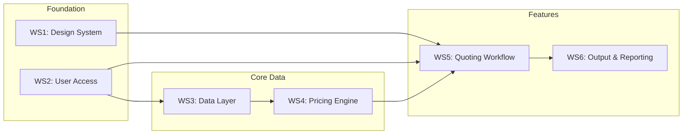
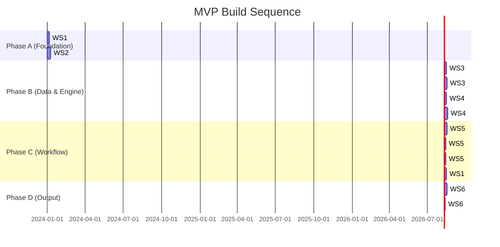

# RateEngine: Structured MVP Roadmap

> **Document Purpose:** Actionable engineering roadmap converting business requirements into sequenced, executable workstreams.

---

## Executive Summary

This roadmap organises outstanding work into **six workstreams** with clear dependencies and a recommended build order that accelerates MVP delivery. Each workstream contains engineering-ready tasks with technical considerations.



---

## Workstream 1: Design System

### Goal
Establish a consistent, professional visual identity across the application with reusable design tokens and component patterns.

### Tasks

| # | Task | Description | Estimate |
|---|------|-------------|----------|
| 1.1 | **Finalise colour palette** | Primary: Blue (`#1E40AF`); Secondary: Orange (trial, swappable via Tailwind token); Info/warnings: Yellow (reserved for alerts/FX staleness only); Define semantic colours | 2h |
| 1.2 | **Select typography** | Choose primary font (e.g., Inter) and heading font; Define type scale (h1-h6, body, caption) | 1h |
| 1.3 | **Create Tailwind theme config** | Update `tailwind.config.ts` with colour tokens, font families, spacing scale, border radii | 2h |
| 1.4 | **Build Style Guide page** | Create `/style-guide` route showcasing colours, typography, buttons, form elements, cards | 4h |
| 1.5 | **Audit and rename components** | Standardise component naming conventions (PascalCase, descriptive names); Document in `CONTRIBUTING.md` | 2h |
| 1.6 | **Refactor existing UI** | Apply new design tokens to all existing pages (Dashboard, Quotes, Rate Cards) | 6h |

### Technical Considerations

- **Tailwind CSS Variables:** Use CSS custom properties for runtime theme switching (dark mode future-proofing).
- **shadcn/ui Integration:** Ensure all custom tokens map correctly to shadcn component theming.
- **Accessibility:** Verify colour contrast ratios meet WCAG 2.1 AA (4.5:1 for text).

### Dependencies
- None (can begin immediately)

### Risks & Assumptions
| Risk | Mitigation |
|------|------------|
| Design decisions delay development | Timebox colour/font decisions to 1 session; use proven palettes |
| Inconsistent component usage | Enforce via ESLint rules + PR review checklist |

---

## Workstream 2: User Access & Permissions (RBAC)

### Goal
Implement role-based access control to protect sensitive data (COGS, margins) and restrict system configuration to authorised users.

### Tasks

| # | Task | Description | Estimate |
|---|------|-------------|----------|
| 2.1 | **Define role matrix** | Document permissions for Sales Rep, Manager, Admin across all features (view/edit COGS, margins, FX, settings) | 2h |
| 2.2 | **Create User Role model** | Add `role` field to User model or create `UserProfile` with role FK; Choices: `SALES_REP`, `MANAGER`, `ADMIN` | 2h |
| 2.3 | **Implement permission decorators** | Create DRF permission classes: `IsSalesRep`, `IsManagerOrAbove`, `IsAdmin` | 3h |
| 2.4 | **Protect API endpoints** | Apply permission classes to sensitive endpoints (rate cards, system settings, COGS data) | 4h |
| 2.5 | **Build role-aware serializers** | Create conditional field serializers that hide COGS from Sales, show to Manager+ | 3h |
| 2.6 | **Frontend role context** | Store user role in auth context; Create `useHasPermission()` hook | 2h |
| 2.7 | **Conditional UI rendering** | Hide/disable UI elements based on role (COGS columns, Settings link, margin fields) | 4h |
| 2.8 | **Admin role management UI** | Allow Admins to assign/change user roles via Settings | 4h |

### Technical Considerations

- **Existing Auth:** Leverage existing token-based authentication; extend User model with role.
- **API Security:** Always enforce permissions server-side; frontend hiding is UX only.
- **Audit Trail:** Consider logging role-based actions for compliance.

### Dependencies
- None for core implementation
- WS1 (Design System) for polished role management UI

### Risks & Assumptions
| Risk | Mitigation |
|------|------------|
| Complex permission logic becomes unmaintainable | Use django-guardian or custom mixin pattern; document clearly |
| Role changes mid-session cause stale UI | Refresh role on critical actions or implement role polling |

---

## Workstream 3: Data Layer (Address Book & Contacts)

### Goal
Create a centralised contact management system for customers, agents, and carriers, plus a flexible discount rules engine.

### Tasks

| # | Task | Description | Estimate |
|---|------|-------------|-----------|
| 3.1 | **Design Contact data model** | Create `Contact` model: `company_name`, `contact_name`, `email`, `phone`, `type` (CUSTOMER/AGENT/CARRIER/FORWARDER), `notes` | 3h |
| 3.2 | **Create Contact API** | CRUD endpoints: `GET/POST /api/v1/contacts/`, `GET/PUT/DELETE /api/v1/contacts/{id}/` | 4h |
| 3.3 | **Build Address Book list page** | Filterable, searchable table with pagination; Filter by contact type | 4h |
| 3.4 | **Build Contact create/edit form** | Modal or dedicated page with all fields; Validation for email format | 3h |
| 3.5 | **Design DiscountRule model** | Create `DiscountRule` model: `contact` FK, `component_category`, `discount_type` (PERCENTAGE/FLAT_AMOUNT/RATE_OVERRIDE), `value`, `active` | 3h |
| 3.6 | **Create DiscountRule API** | CRUD endpoints for managing discount rules per contact | 3h |
| 3.7 | **Build Discount Rules UI** | Nested UI within Contact detail page; Add/edit/delete discount rules per component | 4h |
| 3.8 | **Link Contacts to Quotes** | Add `customer` FK to Quote model; Dropdown selector in quote form | 3h |
| 3.9 | **Auto-apply discounts at SELL layer** | Pricing engine fetches customer discount rules and applies to SELL price calculation only | 4h |
| 3.10 | **Seed demo data** | Management command to seed sample contacts with varied discount rules | 2h |

### Technical Considerations

- **Contact vs DiscountRule separation:** Discounts are NOT stored on Contact; separate `DiscountRule` table linked to Contact.
- **Discount Types (MVP):**
  - `PERCENTAGE` — e.g., 5% off component sell price
  - `FLAT_AMOUNT` — e.g., -$10 off component
  - `RATE_OVERRIDE` — e.g., force component sell to specific rate
- **SELL layer only:** Discounts apply to sell price; COGS/buy rates remain untouched.
- **No lane-based logic in MVP:** All rules apply globally to the contact.
- **Search Performance:** Add `GIN` index on `company_name` for fast search if PostgreSQL.

### Dependencies
- WS2 (User Access) for protecting contact management to appropriate roles

### Risks & Assumptions
| Risk | Mitigation |
|------|------------|
| Discount rule complexity grows | Clear documentation; defer conditional/lane-based logic to Post-MVP |
| Data migration from existing sources | Provide CSV import endpoint in Phase 2 |

---

## Workstream 4: Pricing Engine Logic

### Goal
Extend the pricing engine to support domestic air freight and reliable FX rate management.

### Tasks

| # | Task | Description | Estimate |
|---|------|-------------|----------|
| 4.1 | **Design Domestic rate structure** | Define zones for MVP routes: POM, LAE, HGU, RAB; Weight breaks and rate types | 3h |
| 4.2 | **Create Domestic Rate Card model** | `DomesticRateCard` with `origin_zone`, `destination_zone`, `weight_breaks`, `rates`, `valid_from`, `valid_to` | 4h |
| 4.3 | **Build Domestic Rate Card admin** | Django admin interface for managing domestic rates | 2h |
| 4.4 | **Seed MVP domestic routes** | Management command with rates for: POM⇄LAE, POM⇄HGU, POM⇄RAB | 3h |
| 4.5 | **Extend pricing engine** | Add domestic leg calculation in `pricing_service_v3.py`; Handle domestic ORIGIN/DESTINATION charges | 6h |
| 4.6 | **Create FX Rate model** | `FXRate` with `from_currency`, `to_currency`, `buy_rate`, `sell_rate`, `effective_date`, `updated_by`, `updated_at` | 2h |
| 4.7 | **Build FX management UI** | Admin page to view/edit FX rates; Manual entry only; Show last updated timestamp prominently | 4h |
| 4.8 | **FX fallback logic** | If no rate for today, use most recent; Yellow warning banner if rate is stale (>7 days) | 2h |
| 4.9 | **FX audit trail** | Log all FX rate changes with user and timestamp for compliance | 2h |

### Technical Considerations

- **FX Strategy (Confirmed):** Manual entry only for MVP — no API integration.
- **Buy/Sell Rates:** Store both rates to support margin on FX if needed.
- **Rate Staleness:** Yellow warning banner when FX rate >7 days old.
- **Audit Trail:** Log all FX rate changes with user and timestamp for compliance.

### Dependencies
- WS2 (User Access) for restricting FX management to Admin/Manager roles
- WS3 (Data Layer) for customer discounts in pricing calculations

### Risks & Assumptions
| Risk | Mitigation |
|------|------------|
| FX API rate limits or downtime | Always fall back to last known rate; cache aggressively |
| Domestic route complexity | Start with major routes; expand based on quote volume |

---

## Workstream 5: Quoting Workflow

### Goal
Implement complete quote lifecycle management with UI enhancements for daily usability.

### Tasks

| # | Task | Description | Estimate |
|---|------|-------------|-----------|
| 5.1 | **Define quote lifecycle states** | MVP States: `DRAFT` → `FINALIZED` → `SENT`; FINALIZED = locked/uneditable; edits require cloning | 2h |
| 5.2 | **Add status field to Quote model** | `status` field with choices (`DRAFT`, `FINALIZED`, `SENT`); Add `finalized_at`, `finalized_by`, `sent_at` timestamps | 2h |
| 5.3 | **Implement state machine logic** | Create `QuoteStateMachine` class with transition validation; Prevent invalid transitions | 4h |
| 5.4 | **Block editing when FINALIZED** | Block modifications when status ≠ DRAFT; Return 403 on attempted edits; UI disables all form fields | 3h |
| 5.5 | **Build status management UI** | Status badge on quote detail; Action buttons for valid transitions; Confirmation dialogs | 4h |
| 5.6 | **Add Nav-Bar enhancements** | Add "New Quote" quick-action button; Add Settings dropdown menu with links to: Settings, Address Book, Rate Cards | 3h |
| 5.7 | **Build Settings page** | Centralized settings: FX source, CAF%, margin policy, rounding rules | 4h |
| 5.8 | **Quote cloning** | "Clone Quote" action to create DRAFT copy from any FINALIZED or SENT quote | 2h |
| 5.9 | **Quote version history** | Store version snapshots when quote is finalized; Show version history on detail page | 4h |
| 5.10 | ✅ **AI Rate Intake: Pydantic Schemas** | `SpotChargeLine`, `AIRateIntakeResponse`, `PDFExtractionResult` with validation rules | DONE |
| 5.11 | ✅ **AI Rate Intake: PDF Extraction** | pdfplumber primary, pymupdf fallback, OCR warnings; `pdf_extraction.py` | DONE |
| 5.12 | ✅ **AI Rate Intake: Gemini Integration** | Gemini 2.0 Flash parsing with strict JSON output; `ai_intake_service.py` | DONE |
| 5.13 | ✅ **AI Rate Intake: API Endpoint** | `POST /api/quotes/{id}/ai-intake/` accepting text or PDF; returns validated lines | DONE |
| 5.14 | **AI Rate Intake: Frontend UI** | Paste text / Upload PDF interface; Editable preview table; Accept/reject flow | 6h |

### AI-Assisted Rate Intake (Core MVP Feature)

> [!IMPORTANT]
> AI-Assisted Rate Intake is a **first-class MVP capability**, not a future enhancement.

**Purpose:** Ingest unstructured agent/carrier quotes (email text, PDF documents) and convert them into structured, validated charge lines.

**Non-Negotiable Principles:**
- AI never writes directly to database
- All AI output must pass Pydantic validation
- Human review required before accepting
- AI extracts only — no FX, margins, or pricing decisions

**Architecture Flow:**
```
User (Paste Text / Upload PDF)
        ↓
Backend (PDF → Text extraction)
        ↓
Gemini 2.0 Flash (JSON extraction)
        ↓
Pydantic validation (SpotChargeLine[])
        ↓
Editable Preview UI
        ↓
User Accepts → Persist to Quote
```

See `docs/ARCHITECTURE_PRINCIPLES.md` for complete specification.

### Technical Considerations

- **State Machine Pattern:** Use `django-fsm` for robust state transitions, or implement simple validation.
- **Status Naming:** Use `FINALIZED` (not "locked") consistently across backend enums, UI labels, PDF templates, and audit logs.
- **Optimistic Locking:** Consider `version` field to prevent concurrent edit conflicts.
- **Settings Storage:** Use `django-constance` for dynamic settings or dedicated `SystemSettings` model.
- **Post-MVP States:** WON/LOST/EXPIRED (CRM-style states) deferred to Post-MVP.
### Dependencies
- WS1 (Design System) for consistent UI
- WS2 (User Access) for role-based visibility
- WS4 (Pricing Engine) for quote calculation

### Risks & Assumptions
| Risk | Mitigation |
|------|------------|
| Complex state transitions cause bugs | Comprehensive unit tests for state machine; Use proven library |
| Users confused by finalized quotes | Clear status badges + toast messages explaining state; prominent "Clone" button |

---

## Workstream 6: Output & Reporting

### Goal
Enable professional quote delivery via PDF export with basic audit logging.

### Tasks (MVP)

| # | Task | Description | Estimate |
|---|------|-------------|-----------|
| 6.1 | **Select PDF generation library** | Evaluate: `WeasyPrint`, `reportlab`, `xhtml2pdf`; Recommend WeasyPrint for CSS styling | 2h |
| 6.2 | **Design PDF template** | Create HTML/CSS template matching brand guidelines; Include: logo, quote details, pricing table, T&Cs, validity, version; Use `FINALIZED` status consistently | 6h |
| 6.3 | **Build PDF generation endpoint** | `GET /api/v1/quotes/{id}/pdf/` returns PDF binary; Handle DRAFT watermark | 4h |
| 6.4 | **Add PDF download button** | Quote detail page button; Loading state while generating | 2h |
| 6.5 | **Quote audit log (basic)** | Log all quote actions (view, edit, finalize, export PDF) with timestamp and user | 4h |

### Tasks (Post-MVP)

> [!NOTE]
> The following are explicitly deferred to Post-MVP:

| # | Task | Description |
|---|------|-------------|
| 6.6 | **PDF preview modal** | In-browser PDF preview before download |
| 6.7 | **Design reporting data model** | Key metrics: quote volume, conversion rate, revenue, margin % |
| 6.8 | **Build reporting API** | Endpoints for quotes-summary, conversion, profitability |
| 6.9 | **Create Reports dashboard page** | Charts: Quote volume, Win/Loss ratio, Top customers |
| 6.10 | **Implement export to CSV/Excel** | Download button for report data |

### Technical Considerations

- **PDF Library Comparison:**
  | Library | Pros | Cons |
  |---------|------|------|
  | WeasyPrint | Best CSS support, beautiful output | Requires Cairo; heavier install |
  | reportlab | Pure Python, battle-tested | Programmatic layout (no HTML templates) |
  | xhtml2pdf | Simple HTML→PDF | Limited CSS support |
- **Audit Log Storage:** Use Django's built-in logging or dedicated `AuditLog` model.

### Dependencies
- WS5 (Quoting Workflow) for quote lifecycle data
- WS2 (User Access) for user context in audit logs

### Risks & Assumptions
| Risk | Mitigation |
|------|------------|
| PDF styling doesn't match design | Use WeasyPrint with CSS; iterate with designer |

---

## Recommended Build Order

The following sequence maximises value delivery while respecting technical dependencies:



### Phase Breakdown

| Phase | Duration | Workstreams | Outcome |
|-------|----------|-------------|---------|
| **A: Foundation** | Week 1-2 | WS1 (partial), WS2 | Professional look + secure access |
| **B: Data & Engine** | Week 2-4 | WS3, WS4 | Contact management + discount rules + domestic/FX pricing |
| **C: Workflow** | Week 4-6 | WS5, WS1 (complete) | Full quote lifecycle (DRAFT→FINALIZED→SENT) + polished UI |
| **D: Output** | Week 6-7 | WS6 (MVP only) | PDF export + basic audit log |

---

## Technical Risks Summary

| Risk | Impact | Likelihood | Workstream | Mitigation |
|------|--------|------------|------------|------------|
| Design decisions cause delays | Medium | Medium | WS1 | Timebox decisions; use proven palettes |
| RBAC complexity creeps | High | Medium | WS2 | Start simple; document permission matrix |
| Discount rule edge cases | Medium | Medium | WS3 | Strict component-level scope; defer lane-based logic |
| FX staleness unnoticed | Medium | Low | WS4 | Yellow warning banner; manual entry discipline |
| PDF rendering issues | Medium | Medium | WS6 | Use WeasyPrint; test early with real data |

---

## Confirmed MVP Decisions

| Decision | Choice | Rationale |
|----------|--------|----------|
| **Secondary Colour** | Orange (trial, swappable via Tailwind token) | Energy, CTA strength, contrast against Blue; Yellow reserved for warnings/alerts only |
| **FX Rate Management** | Manual entry only | FX accuracy > automation; avoids API cost/fragility; supports PNG operational reality |
| **Quote Approval** | None — no approval workflow | Engine-first trust model; governance via finalized states, RBAC, audit logs |
| **Quote Lifecycle (MVP)** | DRAFT → FINALIZED → SENT | FINALIZED = locked/uneditable; edits require cloning; WON/LOST/EXPIRED deferred to Post-MVP |
| **Domestic Routes (MVP)** | POM⇄LAE, POM⇄HGU, POM⇄RAB | High-volume, high-frequency; causes daily operational pain; commercially relevant |
| **Discount Engine** | Separate `DiscountRule` table with component-level discounts (%, flat, rate override) at SELL layer only | No lane-based or conditional logic in MVP |
| **AI-Assisted Rate Intake** | Core MVP feature with human-in-the-loop | AI extracts & structures; Pydantic validates; user reviews before accept; AI never writes to DB |
| **Pydantic Usage** | Business-contract validation at service boundaries | Required for: AI output, pricing engine I/O, FX contexts, discount rules, API schemas |

---

## Next Steps

1. ✅ Roadmap approved with decisions confirmed
2. ✅ Architecture Principles documented (`docs/ARCHITECTURE_PRINCIPLES.md`)
3. ✅ AI Rate Intake backend complete (Pydantic schemas, PDF extraction, Gemini integration, API endpoint)
4. 🔲 Install AI dependencies: `pip install pdfplumber pymupdf google-generativeai`
5. 🔲 Set `GEMINI_API_KEY` environment variable
6. 🔲 Build AI Rate Intake frontend UI (task 5.14)
7. 🔲 Create Jira/GitHub tickets from task tables
8. 🔲 Begin Phase A: Design System + RBAC Core in parallel
