# RateEngine – Quoting Flow

This document defines the decision logic and quoting flows for **Air Freight scenarios** in RateEngine, with PNG-specific operational rules. It is intended for product managers and developers to align on business logic, scope constraints, and implementation details.

---

## 1. Shipment Type → Routing Logic

All shipments must be classified as **Import**, **Export**, or **Domestic**. Each type determines the routing path and which legs to include.

```mermaid
flowchart TD
    A[Start] --> B{Shipment Type?}
    B -->|Import (INTL → PNG)| I1[Gateway: POM (Jacksons Int'l) ONLY]
    B -->|Export (PNG → INTL)| E1[Gateway: POM (Jacksons Int'l) ONLY]
    B -->|Domestic (PNG ↔ PNG)| D1[Domestic Routing]

    %% IMPORT
    I1 --> I2[Customs Clearance at POM]
    I2 --> I3{Final Delivery Location = POM?}
    I3 -->|Yes| I4[Finish at POM: Airport→Door or Airport→Airport per Scope]
    I3 -->|No (e.g., LAE / Outer Port)| I5[Add Domestic Onforwarding Leg: POM → Final Port]
    I5 --> I6{Final Port = LAE?}
    I6 -->|Yes (LAE)| I7[Domestic Service: Door↔Door available]
    I6 -->|No (HGU/RAB/HKN/MAG/WWK...)| I8[Domestic Service: Door↔Airport only]
    I7 --> I9[Deliver/Complete]
    I8 --> I9[Deliver/Complete]

    %% EXPORT
    E1 --> E2{Origin Location = POM?}
    E2 -->|Yes| E3[Uplift from POM to Final INTL Destination]
    E2 -->|No (Outer Port)| E4[Add Domestic Pre-Carriage: Origin Port → POM]
    E4 --> E3
    E3 --> E5[Deliver/Complete]

    %% DOMESTIC
    D1 --> D2{Route = POM ↔ LAE?}
    D2 -->|Yes| D3[Door↔Door allowed]
    D2 -->|No (Outer Ports)| D4[Only Door→Airport or Airport→Door]
    D3 --> D5[Deliver/Complete]
    D4 --> D5[Deliver/Complete]
```

**Key PNG Rules:**
- All Imports and Exports *must* pass through **POM**.
- **Domestic POM↔LAE**: Door↔Door possible.
- **Domestic Outer Ports**: Door→Airport or Airport→Door only.

---

## 2. Service Scope → Leg Builder

Defines how legs are built once shipment type/routing is known.

```mermaid
flowchart LR
    S[Select Service Scope] --> C{Scope?}

    C -->|Door→Door| L1[Legs:
      1) Origin Pickup
      2) Main Air Leg
      3) Customs (as needed)
      4) Final Delivery]
    C -->|Door→Airport| L2[Legs:
      1) Origin Pickup
      2) Main Air Leg
      3) Destination Airport Handover]
    C -->|Airport→Airport| L3[Legs:
      1) Origin Airport Handover
      2) Main Air Leg
      3) Destination Airport Handover]
    C -->|Airport→Door| L4[Legs:
      1) Main Air Leg
      2) Customs (as needed)
      3) Final Delivery]

    %% PNG onforwarding insert
    L1 --> R{Does routing require POM onforwarding?}
    L2 --> R
    L3 --> R
    L4 --> R

    R -->|No| Q[Quote Summary Build]
    R -->|Yes| X[Insert Domestic Leg(s):
        - Import: POM → Final Port
        - Export: Origin Port → POM]
    X --> Q
    Q --> Z[Output: Price + Surcharges + Terms]
```

---

## 3. Example Sequence (Import: BNE → LAE, Door→Door)

```mermaid
sequenceDiagram
    participant S as Sales Rep
    participant Q as Quoting Engine
    S->>Q: Shipment Type = Import
    Q->>Q: Route via POM (gateway)
    S->>Q: Scope = Door→Door
    Q->>Q: Build Legs:
    Note over Q: BNE Pickup → BNE→POM Air → POM Clearance → POM→LAE Domestic → LAE Delivery
    Q->>Q: Apply PNG Rule: LAE supports Door→Door ✅
    Q->>Q: Calculate CW, base rate, surcharges (FAF, CAF, security), domestic leg rates
    Q->>S: Quote Summary (payer, Incoterms, totals, validity)
```



---

## Developer Acceptance Criteria

- **Routing Rules:** All INTL shipments must pass through POM, with conditional domestic legs added for non-POM delivery/origin.
- **Service Scope:** Quote builder must dynamically add or exclude legs depending on Door/Airport selection.
- **Domestic Limits:** Door↔Door allowed only for POM↔LAE. Other ports restricted.
- **Chargeable Weight Engine:** Always apply CW = max(Actual vs Volumetric) across all legs.
- **Fallback Handling:** If rate not found (DG restrictions, outer-port limits, etc.), system should trigger Agent Rate Request flow.
- **Logging:** Each quote must record selected Shipment Type, Scope, Incoterm, and Legs for audit and reporting.

---

📌 This document should be version-controlled under `docs/QuotingFlow.md` and referenced in the product roadmap.
