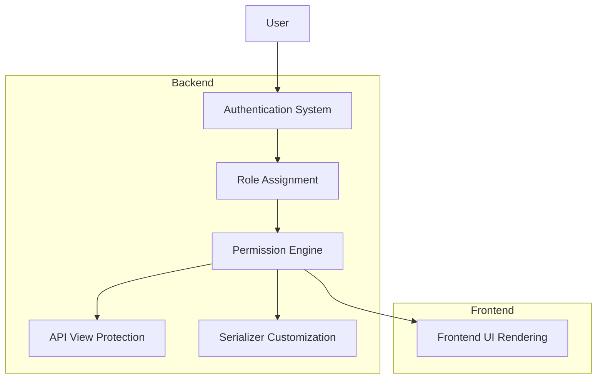

# Role-Based Access Control (RBAC) Architecture Plan

## Overview
This document outlines the architecture and implementation plan for Role-Based Access Control (RBAC) in the RateEngine application. The RBAC system will implement three distinct user roles with different levels of access to application features and data.

## User Roles

### 1. Sales Role
- **Permissions:**
  - Can create and view quotes
  - Can input buy rates (COGS)
  - Cannot change FX, CAF, or margin rules
  - Can only see Sell prices (not COGS)
  - Cannot access system settings

### 2. Manager Role
- **Permissions:**
  - All Sales permissions
  - Can view COGS (cost of goods sold)
  - Can access system settings (read-only)
  - Can approve quotes

### 3. Finance Role
- **Permissions:**
  - All Manager permissions
  - Can modify system settings
  - Can change FX, CAF, and margin rules
  - Full access to all financial data

## Backend Implementation

### 1. User Model Extension
- Extend the existing `CustomUser` model to include a `role` field
- Use Django's built-in `AbstractUser` as the base
- Define role choices as constants

### 2. Permission System
- Implement role-based permissions using Django's permission framework
- Create custom permission classes for API views
- Define object-level permissions where necessary

### 3. API View Protection
- Update viewsets to check user roles before allowing access
- Implement different levels of access for different HTTP methods
- Add role-specific filtering for data retrieval

### 4. Serializer Customization
- Modify serializers to conditionally include/exclude fields based on user roles
- Create role-specific serializers where needed
- Implement dynamic field selection based on user permissions

## Frontend Implementation

### 1. Authentication System
- Implement JWT-based authentication
- Store user role in the application state
- Create authentication context for React components

### 2. Role-Based UI Rendering
- Conditionally render UI components based on user roles
- Hide/show form fields based on permissions
- Disable/enable actions based on role permissions

### 3. API Integration
- Update API calls to handle role-based access
- Implement error handling for permission denied responses
- Add loading states for role-dependent content

## Database Changes

### 1. User Model Migration
- Add `role` field to `CustomUser` model
- Create migration for existing users (default to Sales role)
- Add database constraints for role values

## Security Considerations

### 1. Data Protection
- Ensure COGS data is never exposed to Sales users
- Implement server-side validation for all role-based restrictions
- Prevent client-side manipulation of role information

### 2. API Security
- Validate permissions on all API endpoints
- Implement rate limiting for authentication endpoints
- Use HTTPS for all API communications

## Implementation Steps

### Phase 1: Backend Implementation
1. Update CustomUser model with role field
2. Create role-based permission classes
3. Update viewsets with role checking
4. Modify serializers for role-based field visibility

### Phase 2: Frontend Implementation
1. Implement authentication system
2. Create role-based UI components
3. Update API integration with role checking
4. Add role-based navigation

### Phase 3: Testing and Deployment
1. Test RBAC implementation with different user roles
2. Verify data protection mechanisms
3. Update documentation
4. Deploy to production environment

## Mermaid Diagrams

### RBAC System Architecture


### User Role Hierarchy
```mermaid
graph TD
    A[Finance] --> B[Manager]
    B --> C[Sales]
    
    A -->|Full Access| D[All Features]
    B -->|Read COGS + Settings| E[Limited Features]
    C -->|Sell Only| F[Restricted Features]