# RateEngine Clean Database Architecture v2.1 — Approved

> **Status:** APPROVED ARCHITECTURAL SPECIFICATION — FROZEN\
> **Effective Date:** 2026-09-13\
> **Applies To:** Core RateEngine Database, Pricing V4, Quoting Lifecycle, SPOT Intake, Master Data\
> **Authority:** Commercial Manager & Nas Brain Canonical Policy\
> **Strategy:** Clean-Cut Pre-Production Implementation (Archive Legacy Pre-Production Quotes; Migrate Master Data)

---

## 1. Executive Summary & Context

RateEngine is a dedicated, deterministic commercial freight quotation engine.
This specification establishes the **Clean Database Architecture v2.1**, incorporating the v2.1 Final Candidate and the four approved architectural amendments.

This design eliminates architectural drift, schema debt, competing sources of truth, hardcoded corridor rules, and leaky abstractions accumulated across earlier prototypes.

### Core Decisions
1. **Clean-Cut Cutover:** RateEngine is in pre-production. Legacy development/test quotes (73 quotes, 77 versions, 1,065 lines) and prototype CRM/connote tables are **archived to cold storage** rather than translated via complex migration bridges. Master data (236 accounts/companies, 66 ProductCodes, 85 aliases, 18 canonical charge types, 120 locations, 429 V4 rates, 28 SPOT learning events) is migrated directly into target tables.
2. **Single Commercial Master:** `ProductCode` (`commercial_product_code`) is the sole commercial charge identity across standard tariffs, SPOT intake, and quote persistence, completely retiring `ServiceCode` and `ServiceComponent`.
3. **Counterparty vs. Internal Hierarchy:** Internal EFM operational hierarchy (`org_company → org_operating_entity → org_branch → org_department`) is authoritative for internal structure and RBAC. External counterparties are modeled as `party_master` + `party_role`. Ordinary EFM branches are never duplicated into `party_master`.
4. **Normalized Geo & Network:** All geographic references point to `geo_location.id`. Locations support multiple identifiers via `geo_location_identifier` (IATA, ICAO, UNLOCODE, INTERNAL_STATION). Corridors are governed data-driven by `geo_corridor_policy`, removing any hardcoded POM gateway constraints in model validation.
5. **Rate Model:** Standardized 4-level hierarchy: `rate_sheet → rate_line → rate_applicability → rate_tier`. Supports BUY, SELL, cost-derived, domestic, international, flat, per-unit, tiered, and percentage surcharges without duplicating calculation code.
6. **Market FX vs. Commercial Policy:** Pure market exchange facts (`fx_market_rate`) are strictly decoupled from versioned commercial markup/margin/CAF rules (`policy_commercial_terms`).
7. **Immutable Historical Quotes:** Finalized quote versions freeze all line calculations, including underlying pricing method, margin method, applied percentages, CAF treatment, and applied FX rates.
8. **Dual-Track SPOT Validity:** Supplier quote validity fails closed when missing; operator-confirmed validity requires explicit authorization and is tracked distinctly from supplier fact.
9. **Portability Invariant:** Strict PostgreSQL database-level integrity (GiST exclusion constraints via `btree_gist`, CHECK constraints) paired with deterministic Django model `clean()` validation for SQLite development and CI.

---

## 2. Architecture Principles

The target database architecture adheres to 12 binding principles:

1. **Quote-First Product Boundary:** The schema exists solely to support freight quotation lifecycles. CRM opportunity pipelines and operational consignment/freight-tracking models are excluded.
2. **Deterministic Commercial Integrity:** Given identical inputs and effective dates, the engine must produce identical quote calculations. No silent fallbacks, guessed rates, or interpolated tariffs.
3. **Single Commercial Identity:** Every priced line item must resolve to an approved `ProductCode`. `ProductCode` owns the canonical GST/tax treatment classification.
4. **Strict Counterparty Normalization:** Legal/commercial entities are defined once in `party_master` and assigned zero or more `party_roles` (CUSTOMER, CARRIER, AGENT, SUPPLIER, VENDOR). Internal EFM branches are not duplicated as parties.
5. **Location Normalization:** Geographic places exist once in `geo_location`. Industry codes (IATA, UNLOCODE) are stored in `geo_location_identifier`. Corridors and rates reference location IDs, never raw text strings.
6. **Data-Driven Network Topology:** Freight routing, corridor validity, and transit requirements are determined by configuration in `geo_corridor_policy`. Port Moresby (POM) is an operational corridor hub, not a hardcoded database constraint.
7. **Single Flexible Rate Hierarchy:** Tariffs are modeled via `rate_sheet → rate_line → rate_applicability → rate_tier`. All rating structures (BUY, SELL, flat, per-kg, tiered weight, percentage) utilize this unified structure.
8. **Separation of Market Facts from Commercial Policy:** Bank TT FX rates represent objective historical/market facts. Profit margins, CAF rules, and tax parameters represent versioned management policy.
9. **Immutable Finalized Commercial Snapshots:** Finalized quotes are frozen commercial snapshots. Subsequent tariff updates, FX movements, or policy revisions must never alter finalized quotes.
10. **Fail-Closed SPOT Ingestion:** AI extraction and supplier quotes accelerate intake but do not finalize commercial decisions. Missing supplier validity fails closed unless an authorized operator explicitly records an approved validity period.
11. **Granular SPOT Replacement:** SPOT freight replaces the exact matching standard line item, never entire buckets or unrelated standard charges. Domestic and destination charges are preserved.
12. **Dual-Layer Database Portability:** PostgreSQL enforces relational and mathematical integrity via CHECK, UNIQUE, and GiST EXCLUDE constraints. Django models provide identical deterministic validation in SQLite environments.

---

## 3. Target Domain Model

### 3.1 Organization & Internal Structure (Domain 1)

```
org_company
  └── org_operating_entity
        └── org_branch
              └── org_department
```

| Table | Purpose | PK | Important FKs | Key Fields | Constraints | Source of Truth Owned |
| :--- | :--- | :--- | :--- | :--- | :--- | :--- |
| `org_company` | Legal parent organization (e.g. EFM Group) | `id` (UUID) | None | `name`, `code`, `country_code`, `currency_code`, `is_active` | `UNIQUE(code)` | EFM Corporate Identity |
| `org_operating_entity` | Operating legal entity (e.g. Express Freight Management PNG Ltd, EFM Australia Pty Ltd) | `id` (UUID) | `company_id → org_company.id` | `name`, `code`, `tax_id`, `functional_currency`, `is_active` | `UNIQUE(company_id, code)` | Legal Entities & Tax Registration |
| `org_branch` | Physical EFM operational station (e.g. POM, LAE, BNE, SYD) | `id` (UUID) | `operating_entity_id → org_operating_entity.id`, `location_id → geo_location.id` | `name`, `code`, `is_active` | `UNIQUE(operating_entity_id, code)` | EFM Branch Network & Operational Stations |
| `org_department` | Functional unit within a branch (Air Freight, Sea Freight, Customs, Sales) | `id` (UUID) | `branch_id → org_branch.id` | `name`, `code`, `is_active` | `UNIQUE(branch_id, code)` | Departmental Cost Centers & Workflows |

*Amendment 1 Governance:* EFM internal branches (POM, LAE, BNE) live exclusively in `org_branch`. They are never duplicated into `party_master`. If an EFM legal entity acts as a counterparty in an intercompany transaction, an explicit relationship is declared on the legal entity.

---

### 3.2 Parties & Counterparties (Domain 2)

```
party_master
  ├── party_role (CUSTOMER, CARRIER, AGENT, SUPPLIER, VENDOR)
  │     └── party_role_identifier (e.g. IATA carrier code, Customs agent code)
  ├── party_contact
  └── party_address
```

| Table | Purpose | PK | Important FKs | Key Fields | Constraints | Source of Truth Owned |
| :--- | :--- | :--- | :--- | :--- | :--- | :--- |
| `party_master` | Canonical commercial counterparty (customers, shipping lines, airlines, cartage vendors) | `id` (UUID) | None | `legal_name`, `trade_name`, `entity_type`, `country_code`, `is_active`, `created_at` | `UNIQUE(legal_name, country_code)` | Counterparty Master Identity |
| `party_role` | Normalized role played by a party | `id` (UUID) | `party_id → party_master.id` | `role_type` (ENUM: CUSTOMER, CARRIER, AGENT, SUPPLIER, VENDOR), `is_active` | `UNIQUE(party_id, role_type)` | Counterparty Commercial Functions |
| `party_role_identifier` | Domain/industry identifiers specific to a role | `id` (UUID) | `role_id → party_role.id` | `scheme` (ENUM: IATA_CARRIER, ICAO, SCAC, CUSTOMS_BROKER, TAX_ID), `value` | `UNIQUE(scheme, value)` | Official Industry Identifiers |
| `party_contact` | Individual contact person for a counterparty | `id` (UUID) | `party_id → party_master.id` | `first_name`, `last_name`, `email`, `phone`, `job_title`, `is_primary` | `UNIQUE(party_id, email)` | Commercial Points of Contact |
| `party_address` | Physical / postal addresses for counterparties | `id` (UUID) | `party_id → party_master.id`, `location_id → geo_location.id` | `address_type` (BILLING, PHYSICAL, DEPOT), `line1`, `line2`, `city`, `postal_code`, `is_primary` | None | Physical & Billing Addresses |

---

### 3.3 Geography & Network Corridors (Domain 3)

```
geo_location
  ├── geo_location_identifier (IATA, ICAO, UNLOCODE, INTERNAL_STATION)
  └── geo_corridor_policy (Origin → Destination rules)
```

| Table | Purpose | PK | Important FKs | Key Fields | Constraints | Source of Truth Owned |
| :--- | :--- | :--- | :--- | :--- | :--- | :--- |
| `geo_location` | Normalized physical place, airport, seaport, or city | `id` (UUID) | None | `canonical_name`, `country_code`, `state_province`, `location_type` (AIRPORT, SEAPORT, CITY, INLAND_HUB), `is_active` | None | Canonical World Locations |
| `geo_location_identifier` | Industry and standard codes for a location | `id` (UUID) | `location_id → geo_location.id` | `scheme` (ENUM: IATA, ICAO, UNLOCODE, INTERNAL_STATION), `code` | `UNIQUE(scheme, code)` | Standard Transport Codes |
| `geo_corridor_policy` | Configurable routing, corridor rules, and transit policy | `id` (UUID) | `origin_id → geo_location.id`, `destination_id → geo_location.id`, `via_hub_id → geo_location.id` (opt) | `transport_mode` (AIR, SEA, ROAD), `automation_enabled`, `is_active`, `requires_transit_hub`, `default_transit_days`, `valid_from`, `valid_until` | `UNIQUE(origin_id, destination_id, transport_mode, via_hub_id)` | Data-Driven Network Corridors |

*Location Identifier Governance:* The only schemes are `IATA`, `ICAO`, `UNLOCODE`, and `INTERNAL_STATION`. `INTERNAL_STATION` is EFM's controlled operational identifier where no appropriate external standard exists. GPS coordinates are attributes of `GeoLocation`, not identifiers. Postal codes belong to address records. An unrestricted identifier namespace is excluded; adding another scheme requires an explicit architecture decision.

*Corridor Rule Governance:* Removes hardcoded POM gateway constraints. Routing rules (such as requiring a transit hub via POM or SIN) are defined dynamically in `geo_corridor_policy`. Corridor automation requires explicit approval: `automation_enabled` defaults to `False`; a corridor's existence in the database does not authorize automated quoting.

*Wave 3B4A implementation state:* A forward migration backfills `AIRPORT` geography only where legacy `Location.code`, its Airport FK/IATA code, city, and country agree. `core.geo_mapping.resolve_geo_location` resolves those rows through an IATA identifier and fails closed otherwise; `geo_mapping_health` reports remaining gaps. Legacy quote FKs and route automation remain unchanged. The data-driven corridor behavior above is a target for a later wave, not current runtime behavior.

*Wave 3B4B implementation state:* Journey persistence and diagnostics resolve the customer origin, destination, and planned POM transit hub through exact IATA identifiers, then require one active, date-valid `AIR` `GeoCorridorPolicy` with `automation_enabled=True`. Missing or unresolved geography and corridors yield `ROUTE_AUTOMATION_DISABLED`. The old route-pattern policy table is removed by a forward migration; no corridors are seeded or enabled. Journey history fields and POM leg construction remain unchanged.

---

### 3.4 Commercial Products & Policy (Domain 4)

```
commercial_product_code
  ├── commercial_charge_alias (unmatched supplier text mappings)
  └── policy_commercial_terms (versioned commercial rules)
fx_market_rate (pure market exchange rates)
```

| Table | Purpose | PK | Important FKs | Key Fields | Constraints | Source of Truth Owned |
| :--- | :--- | :--- | :--- | :--- | :--- | :--- |
| `commercial_product_code` | Sole commercial master of billable/payable freight charges | `id` (UUID) | None | `code`, `name`, `category` (FREIGHT, ORIGIN, DESTINATION, CLEARANCE, SERVICE), `sub_category`, `gst_treatment` (FREIGHT_EXPORT, FREIGHT_IMPORT, DOMESTIC_STANDARD, EXEMPT, ZERO_RATED), `charge_basis_default`, `is_active` | `UNIQUE(code)` | Sole Master of Commercial Charges & GST Classification |
| `commercial_charge_alias` | Known supplier text strings mapped to ProductCodes | `id` (UUID) | `product_code_id → commercial_product_code.id` | `raw_text`, `transport_mode`, `carrier_party_id → party_master.id` (opt), `source_currency` (opt), `confidence_score` | `UNIQUE(raw_text, transport_mode, carrier_party_id)` | Intake Normalization Authority |
| `fx_market_rate` | Pure historical/market exchange rates | `id` (UUID) | None | `base_currency`, `quote_currency`, `effective_date`, `tt_buy_rate`, `tt_sell_rate`, `mid_rate`, `source` | `UNIQUE(base_currency, quote_currency, effective_date, source)` | Market FX Facts |
| `policy_commercial_terms` | Versioned commercial terms, margins, CAF, and tax rates | `id` (UUID) | None | `policy_code`, `valid_from`, `valid_until`, `margin_percent`, `margin_method` (MARKUP_ON_COST, TARGET_GROSS_MARGIN), `import_caf_percent`, `export_caf_percent`, `gst_standard_percent`, `is_active` | `CHECK(valid_until IS NULL OR valid_until > valid_from)` | Versioned Commercial Pricing Policy |

*Amendment 2 Governance:* `commercial_product_code.gst_treatment` is the sole owner of GST/tax classification. `policy_commercial_terms` defines only the versioned rate (e.g. 10%) and application formula, eliminating conflicting tax definitions. RateEngine has no universal/default margin: `margin_percent` is nullable policy data with no database default; approved SELL rates are not re-margined, and missing applicable commercial policy fails closed.

*Amendment 3 (Wave 3B2 Architecture Correction — Explicit Margin Representation):*
To eliminate ambiguity between markup on cost and target gross margin, `policy_commercial_terms` explicitly decouples percentage magnitude (`margin_percent`) from the commercial calculation method (`margin_method`):
- `MARKUP_ON_COST` (Default / Launch Parity): $\text{SELL} = \text{Cost} \times (1 + \text{margin\_rate})$. Canonical `LAUNCH-POLICY-2026` seeds `margin_percent = 20.00%` and `margin_method = MARKUP_ON_COST` (yielding K120 on K100 cost), preserving exact baseline pricing parity.
- `TARGET_GROSS_MARGIN` (Supported Target): $\text{SELL} = \frac{\text{Cost}}{1 - \text{margin\_rate}}$ (yielding K125 on K100 cost at 20% margin, where gross margin is strictly $(125 - 100) / 125 = 20\%$).
- RateEngine enforces that approved direct SELL rates are never re-margined, and cost-derived calculations fail closed if required margin policy is absent.

---

### 3.5 Rate Matrix Architecture (Domain 5)

```
rate_sheet
  └── rate_line
        ├── rate_applicability
        └── rate_tier
```

| Table | Purpose | PK | Important FKs | Key Fields | Constraints | Source of Truth Owned |
| :--- | :--- | :--- | :--- | :--- | :--- | :--- |
| `rate_sheet` | Grouping of tariff rates for a carrier, customer, or general card | `id` (UUID) | `party_id → party_master.id` (opt), `carrier_id → party_master.id` (opt) | `name`, `rate_type` (BUY, SELL), `transport_mode`, `currency_code`, `valid_from`, `valid_until`, `is_active`, `version` | `CHECK(valid_until IS NULL OR valid_until >= valid_from)` | Tariff Sheet Container |
| `rate_line` | Individual tariff rate line for a ProductCode | `id` (UUID) | `sheet_id → rate_sheet.id`, `product_code_id → commercial_product_code.id` | `rate_basis` (FLAT, PER_KG, PER_CBM, PER_UNIT, TIERED_WEIGHT, PERCENTAGE), `unit_rate`, `min_charge`, `max_charge`, `percentage_rate`, `percentage_basis_product_code_id` | `CHECK(unit_rate >= 0)`, `CHECK(min_charge <= max_charge)`, Mutual exclusivity CHECKs | Rate Definition |
| `rate_applicability` | Spatial, corridor, commodity, and service filters for a rate line | `id` (UUID) | `rate_line_id → rate_line.id` (1:1), `origin_id → geo_location.id` (opt), `destination_id → geo_location.id` (opt) | `service_level` (EXPRESS, STANDARD, DEFERRED), `commodity_category`, `direction` (IMPORT, EXPORT, DOMESTIC), `equipment_type` | None | Rate Applicability Scope |
| `rate_tier` | Weight/volume breaks for tiered rates | `id` (UUID) | `rate_line_id → rate_line.id` | `min_quantity`, `max_quantity`, `unit_rate` | `CHECK(max_quantity IS NULL OR max_quantity > min_quantity)`, `CHECK(unit_rate >= 0)`, GiST Exclusion (PG) | Breakpoint Rates |

*Amendment 3 Governance:*
- Database CHECK constraints enforce mutual exclusivity: if `rate_basis == 'PERCENTAGE'`, `percentage_rate` is non-null and `unit_rate` is null; if `rate_basis == 'TIERED_WEIGHT'`, `unit_rate` is null.
- PostgreSQL GiST exclusion constraint (`EXCLUDE USING gist (rate_line_id WITH =, numrange(min_quantity, max_quantity, '[)') WITH &&)`) prevents overlapping weight breaks at the database level.
- Django model validation mirrors this on SQLite, enforcing that `TIERED_WEIGHT` lines must have at least one tier and non-tiered lines cannot have tiers.

---

### 3.6 Quote Lifecycle & Immutability (Domain 6)

```
quote_master
  └── quote_version
        ├── quote_line (Snapshot fields: pricing_method, margin_percent, applied FX, etc.)
        └── quote_chargeable_weight
```

| Table | Purpose | PK | Important FKs | Key Fields | Constraints | Source of Truth Owned |
| :--- | :--- | :--- | :--- | :--- | :--- | :--- |
| `quote_master` | Identity anchor for a quotation | `id` (UUID) | `customer_party_id → party_master.id`, `origin_branch_id → org_branch.id` | `quote_number` (e.g. `QT-2026-0001`), `created_at`, `status` (DRAFT, FINALIZED, ACCEPTED, DECLINED, EXPIRED, ARCHIVED) | `UNIQUE(quote_number)` | Commercial Quote Identity |
| `quote_version` | Discrete version of a quotation | `id` (UUID) | `quote_id → quote_master.id`, `created_by_user_id → accounts_user.id`, `policy_version_id → policy_commercial_terms.id` | `version_number`, `status` (DRAFT, FINALIZED, SUPERSEDED), `customer_currency`, `origin_location_id`, `destination_location_id`, `service_level`, `incoterm`, `valid_until`, `total_cogs_quote_ccy`, `total_sell_quote_ccy`, `total_margin_quote_ccy`, `total_gst_quote_ccy`, `finalized_at` | `UNIQUE(quote_id, version_number)` | Version Commercial Calculations |
| `quote_line` | Frozen commercial charge line | `id` (UUID) | `version_id → quote_version.id`, `product_code_id → commercial_product_code.id`, `carrier_party_id → party_master.id` (opt), `source_rate_line_id → rate_line.id` (opt), `spot_resolution_id → spot_resolution.id` (opt) | `description`, `charge_category`, `cost_amount_native`, `cost_currency`, `sell_amount_native`, `sell_currency`, `fx_side_applied`, `fx_rate_applied`, `cost_amount_quote_ccy`, `sell_amount_quote_ccy`, `pricing_method`, `margin_method`, `margin_percent`, `caf_treatment`, `caf_percent`, `is_included`, `gst_treatment`, `gst_amount_quote_ccy` | None | Frozen Line-Level Commercial Calculation Evidence |

*Amendment 4 Governance:* `quote_line` captures complete, immutable pricing evidence:
- `pricing_method` (ENUM: DIRECT_SELL, COST_PLUS_MARGIN, SPOT_PASS_THROUGH, TARIFF_OVERRIDE)
- `margin_method` (ENUM: TARGET_GROSS_MARGIN, FIXED_MARKUP, ZERO_MARGIN)
- `margin_percent` (e.g. `15.00`)
- `caf_treatment` (ENUM: NONE, IMPORT_DEDUCTED_BUY, EXPORT_ADDED_SELL)
- `caf_percent` (e.g. `5.00` or `10.00`)
- `fx_side_applied` (ENUM: TT_BUY, TT_SELL, MID_RATE, PARITY)
- `fx_rate_applied` (e.g. `0.4180`)
- `policy_version_id` (foreign key to the exact commercial terms applied)

---

### 3.7 SPOT Pipeline & Completeness Validation (Domain 7)

```
spot_submission
  ├── spot_raw_line (Immutable supplier text / extraction fact)
  │     └── spot_staged_extraction (AI/deterministic structured fields)
  │           └── spot_resolution (Approved commercial mapping)
  │                 │
  │                 ├──► [SPOT Completeness Validation Gate]
  │                 │       ▲
  │                 │       ├── spot_completeness_template / ExpectedChargeTemplate
  │                 │       └── spot_completeness_template_line / ExpectedTemplateLine
  │                 │             (Evaluates REQUIRED, OPTIONAL, CONDITIONAL, EXCLUDED)
  │                 │
  │                 └──► quote_line (Commercial quote line handoff)
  │
  ├── spot_exception_audit / SpotResolutionLearningEvent (Operator learning facts)
  └── spot_template_validation_review / event / snapshot (Completeness review audit)
```

| Table | Purpose | PK | Important FKs | Key Fields | Constraints | Source of Truth Owned |
| :--- | :--- | :--- | :--- | :--- | :--- | :--- |
| `spot_submission` | Container for an intake event (email paste, PDF) | `id` (UUID) | `quote_version_id → quote_version.id`, `supplier_party_id → party_master.id` (opt) | `intake_channel` (PASTE, PDF, EMAIL), `raw_content`, `created_at`, `status` (PENDING, RESOLVED, REJECTED) | None | Intake Event & Raw Evidence |
| `spot_raw_line` | Raw text lines extracted from submission | `id` (UUID) | `submission_id → spot_submission.id` | `line_number`, `raw_text`, `page_number` (opt) | `UNIQUE(submission_id, line_number)` | Original Source Facts |
| `spot_staged_extraction` | Structured candidate interpretation of a raw line | `id` (UUID) | `raw_line_id → spot_raw_line.id` | `extracted_currency`, `extracted_amount`, `extracted_basis`, `supplier_valid_until`, `proposed_product_code_id`, `confidence`, `status` (UNREVIEWED, ACCEPTED, MODIFIED, REJECTED) | None | Structured Parsing Truth |
| `spot_resolution` | Final commercial mapping handoff to pricing | `id` (UUID) | `staged_extraction_id → spot_staged_extraction.id`, `approved_product_code_id → commercial_product_code.id`, `authorized_by_user_id → accounts_user.id` | `final_currency`, `final_cost_amount`, `final_basis`, `efm_valid_until`, `is_operator_confirmed_validity`, `resolution_notes`, `resolved_at` | None | Commercial Handoff to Quoting Engine |
| `spot_completeness_template`<br>*(Existing: `ExpectedChargeTemplate`)* | Context criteria under which a set of charge expectations is applicable | `id` (Int/UUID) | None | `name`, `mode` (IMPORT, EXPORT, DOMESTIC), `transport_mode`, `service_scope`, `origin_code`, `destination_code`, `is_active` | None | Commercial Completeness Rules |
| `spot_completeness_template_line`<br>*(Existing: `ExpectedTemplateLine`)* | Charge expectation line with requirement semantics | `id` (Int/UUID) | `template_id → spot_completeness_template.id`, `canonical_charge_type_id → canonical_charge_types.id` | `requirement_level` (REQUIRED, OPTIONAL, CONDITIONAL, EXCLUDED), `expected_basis`, `sort_order`, `is_active` | `UNIQUE(template_id, canonical_charge_type_id)` | Line-Level Completeness Invariant |
| `spot_template_validation_review`<br>*(Existing: `SpotTemplateValidationReview`)* | Audit of human review for missing/unexpected charges | `id` (UUID) | `envelope_id / submission_id`, `reviewed_by → accounts_user.id` | `finding_code`, `finding_fingerprint`, `comment`, `reviewed_at` | `UNIQUE(envelope_id, finding_fingerprint)` | Safety-Gate Audit Evidence |
| `spot_template_validation_event`<br>*(Existing: `SpotTemplateValidationEvent`)* | Immutable history of completeness checks and reviews | `id` (UUID) | `envelope_id / submission_id` | `event_type`, `finding_code`, `canonical_type`, `created_at` | None | Operational Audit History |

*SPOT Validity & Completeness Safety Gate:*
1. **Supplier Validity**: Missing supplier validity fails closed. If `supplier_valid_until` is null, the quote cannot be finalized without explicit operator authorization (`efm_valid_until`, `is_operator_confirmed_validity = TRUE`, `authorized_by_user_id`).
2. **Completeness Safety Gate**: Before safe finalization, SPOT responses are evaluated against `spot_completeness_template`. Missing `REQUIRED` charges block finalization unless explicitly acknowledged/waived in `spot_template_validation_review`. Unexpected `EXCLUDED` charges trigger review flags.
3. **Preservation Invariant**: Existing models (`ExpectedChargeTemplate`, `ExpectedTemplateLine`, `SpotTemplateValidationReview`, `SpotTemplateValidationEvent`) remain active in `quotes` until the target schema has an explicit replacement and regression tests prove equivalent safety behavior.

---

## 4. Relationship Map (ASCII ER Model)

```
===================================================================================================
                                      ORGANIZATION & PARTIES
===================================================================================================
[org_company] 1──* [org_operating_entity] 1──* [org_branch] 1──* [org_department]
                                                     │ (Station Location)
                                                     ▼
[party_master] 1──* [party_role] 1──* [party_role_identifier]
      │               │ (CUSTOMER, CARRIER, AGENT, SUPPLIER, VENDOR)
      │               ▼
      ├───1──* [party_contact]
      └───1──* [party_address] 1──* [geo_location]
                                          ▲
===================================================================================================
                                      GEOGRAPHY & CORRIDORS
===================================================================================================
[geo_location] 1──* [geo_location_identifier] (IATA, ICAO, UNLOCODE, INTERNAL_STATION)
      ▲
      ├── Origin / Destination / Hub
      ▼
[geo_corridor_policy] (Dynamic Network Topology - No hardcoded POM gate)

===================================================================================================
                                  COMMERCIAL MASTER & POLICY
===================================================================================================
[commercial_product_code] 1──* [commercial_charge_alias]
      │ (Sole Master & GST Owner)
      │
[policy_commercial_terms] (Versioned Margins, CAF, Tax Rates)
[fx_market_rate]          (Pure Bank TT Buy/Sell Market Facts)

===================================================================================================
                                         RATE MATRIX
===================================================================================================
[rate_sheet] (BUY / SELL)
      │
      └──1──* [rate_line] 1──1 [rate_applicability] ──* [geo_location] (Origin/Dest)
                   │
                   ├──* [commercial_product_code]
                   └──1──* [rate_tier] (Non-overlapping weight/volume breaks)

===================================================================================================
                                 QUOTE LIFECYCLE & IMMUTABILITY
===================================================================================================
[quote_master] 1──* [quote_version]
                         │
                         ├──* [policy_commercial_terms] (Applied Policy Version)
                         └──1──* [quote_line] (Frozen Commercial Snapshot)
                                     ├──* [commercial_product_code]
                                     ├──* [rate_line] (Source Tariff Line, if standard)
                                     └──* [spot_resolution] (Source SPOT, if spot)

===================================================================================================
                                        SPOT PIPELINE
===================================================================================================
[spot_submission] 1──* [spot_raw_line] 1──* [spot_staged_extraction] 1──1 [spot_resolution]
                                                                                │
                                                                                ▼
                                                                      (Handoff to quote_line)
===================================================================================================
```

---

## 5. Rate Architecture & Calculation Logic

RateEngine prices all freight lines deterministically without duplicated calculation code:

### 5.1 BUY vs. SELL Tariffs
- A `rate_sheet` has `rate_type` of either `BUY` (cost from carrier/vendor) or `SELL` (approved client tariffs).
- When an explicit `SELL` tariff exists for a customer/commodity/corridor, the engine prices SELL directly from `rate_line.unit_rate` without re-margining.
- When only a `BUY` tariff exists, the engine calculates:
  - If `margin_method == 'MARKUP_ON_COST'` (Canonical 2026 Launch Policy):
    $$\text{SELL} = (\text{CostNative} \times \text{FXAdjusted}) \times (1 + \text{margin\_rate})$$
  - If `margin_method == 'TARGET_GROSS_MARGIN'`:
    $$\text{SELL} = \frac{\text{CostNative} \times \text{FXAdjusted}}{1 - \text{margin\_rate}}$$
  where `margin_rate` and `margin_method` are governed by `policy_commercial_terms` (e.g. 20% markup on cost for launch parity).

### 5.2 Currency & Pure Market FX
- Cost is evaluated in `rate_line.currency_code`.
- Quote is denominated in `quote_version.customer_currency`.
- Conversion uses `fx_market_rate` for the applicable quote effective date:
  - **Import CAF Rule:** Deduct 5% from Bank TT BUY rate.
  - **Export CAF Rule:** Add 10% to Bank TT SELL rate.
- If FX rate is missing for the currency pair on the effective date, calculation fails closed.

### 5.3 Rating Calculations
1. **Flat Fee:** $\text{Amount} = \text{unit\_rate}$
2. **Per Unit (kg/cbm):** $\text{Amount} = \max(\text{Quantity} \times \text{unit\_rate}, \text{min\_charge})$
3. **Tiered Weight:** RateEngine matches chargeable weight $W$ against `rate_tier` where $\text{min\_quantity} \le W < \text{max\_quantity}$, and evaluates:
   $$\text{Amount} = \max(W \times \text{tier.unit\_rate}, \text{min\_charge})$$
4. **Percentage Surcharge:** Surcharge calculates strictly as:
   $$\text{Amount} = \text{percentage\_rate} \times \sum \text{BaseProductCodes}$$
   where base charges must be resolved before percentage evaluation.

### 5.4 Granular SPOT Replacement
- Standard rating executes first for all legs.
- When an approved `spot_resolution` exists, it replaces the **exact matching commercial ProductCode line item** (e.g., standard air freight).
- Unrelated standard line items (origin cartage, doc fees, customs clearance, destination delivery) remain intact.
- Domestic legs are never overwritten by international SPOT lines.

---

## 6. Quote Snapshot Architecture

### 6.1 State Transitions

```
[DRAFT] ──────(Finalize)──────► [FINALIZED] ──────(Supersede)──────► [SUPERSEDED]
   │                                   │
   ▼                                   ▼
Mutable / Dynamic Relational        Completely Frozen Snapshot
```

### 6.2 Relational/Live vs. Frozen Snapshot Boundaries

| Quote Attribute / Entity | Behavior during DRAFT | Behavior upon FINALIZED |
| :--- | :--- | :--- |
| **Customer Contact / Address** | Relational link to `party_master` / `party_contact` | Frozen text snapshot copied to `quote_version` |
| **Tariff Line Changes** | Re-evaluation updates line costs on recalculation | Completely isolated; tariff changes do not touch finalized lines |
| **Market FX Rates** | Live lookup against latest `fx_market_rate` | Frozen `fx_rate_applied` and `fx_side_applied` on every line |
| **Commercial Terms / Margins** | Live policy evaluation | Policy version FK locked; `margin_percent` frozen on every line |
| **Line Items & Totals** | Dynamic CRUD operations allowed | Table row updates rejected at model/ORM level |
| **Public Output & PDF** | Marked "DRAFT / ESTIMATE" | Stable, immutable commercial artifact with cryptographic checksum |

---

## 7. Database Portability & Constraint Architecture

RateEngine operates on **PostgreSQL in Production / Cloud Run** and **SQLite in Local Development / CI**.

### 7.1 PostgreSQL Native Integrity
1. **Extensions:** Requires `CREATE EXTENSION IF NOT EXISTS btree_gist;`
2. **Exclusion Constraint on Weight Tiers:**
   ```sql
   ALTER TABLE rate_tier
   ADD CONSTRAINT exclude_overlapping_rate_tiers
   EXCLUDE USING gist (
       rate_line_id WITH =,
       numrange(min_quantity, max_quantity, '[)') WITH &&
   );
   ```
3. **Mutual Exclusivity Constraints on `rate_line`:**
   ```sql
   ALTER TABLE rate_line
   ADD CONSTRAINT check_rate_basis_exclusivity
   CHECK (
       (rate_basis = 'FLAT' AND unit_rate IS NOT NULL AND percentage_rate IS NULL) OR
       (rate_basis IN ('PER_KG', 'PER_CBM', 'PER_UNIT') AND unit_rate IS NOT NULL AND percentage_rate IS NULL) OR
       (rate_basis = 'TIERED_WEIGHT' AND unit_rate IS NULL AND percentage_rate IS NULL) OR
       (rate_basis = 'PERCENTAGE' AND unit_rate IS NULL AND percentage_rate IS NOT NULL AND percentage_basis_product_code_id IS NOT NULL)
   );
   ```

### 7.2 SQLite Development / CI Parity
Since SQLite lacks `btree_gist` and GiST exclusion constraints, model validation parity is strictly enforced in Python:
- `RateTier.clean()` checks for overlapping intervals within the same `rate_line_id`:
  ```python
  def clean(self):
      overlapping = RateTier.objects.filter(
          rate_line=self.rate_line,
          min_quantity__lt=self.max_quantity or Decimal('Infinity'),
          max_quantity__gt=self.min_quantity,
      ).exclude(pk=self.pk)
      if overlapping.exists():
          raise ValidationError("Rate tiers for the same rate line cannot overlap.")
  ```
- `RateLine.clean()` enforces:
  1. If `rate_basis == 'TIERED_WEIGHT'`, verifies at least one `RateTier` exists before activation.
  2. If `rate_basis != 'TIERED_WEIGHT'`, raises `ValidationError` if any child `RateTier` rows exist.
  3. Validates mutual exclusivity of `unit_rate` and `percentage_rate`.

---

## 8. Superseded Documents Registry

The following historical documents in the repository are **SUPERSEDED** by this specification:

| File Path | Original Scope | Reason Superseded / Current Status |
| :--- | :--- | :--- |
| `docs/pricing_v3_overview.md` | Legacy V3 pricing engine architecture | Replaced by V4 deterministic engine and clean schema v2.1. |
| `docs/pricing_v4_normalization_plan.md` | Early V4 model transition draft | Fully realized and superseded by clean database architecture v2.1. |
| `docs/crm-module-v1.md` | Initial CRM module design and workflows | CRM is explicitly excluded from RateEngine product scope. |
| `docs/spot-canonical-charge-architecture.md` | Historical SPOT design proposal | Replaced by normalized 3-stage SPOT pipeline and ProductCode single master. |
| `docs/spot-expected-charge-template-architecture.md` | SPOT charge template proposal | **ACTIVE CAPABILITY PRESERVED**: The expected-charge validation framework is preserved as the dedicated SPOT completeness validation layer. Existing models (`ExpectedChargeTemplate`, `ExpectedTemplateLine`, etc.) remain active until an explicit target replacement is implemented with regression tests. |
| `docs/spot-workspace-integration-plan.md` | Workspace UI integration draft | Superseded by clean quote lifecycle and exception workspace specs. |
| `docs/RFC_Multi_Leg_Rating.md` | Initial multi-leg rating RFC | Incorporated into data-driven corridor policy and unified rate matrix. |
| `docs/QuotingMatrix.md` | Early quoting spreadsheet reference | Replaced by formal relational domain model and `geo_corridor_policy`. |
| `docs/customer-data-seeding.md` | Prototype seed instructions | Replaced by clean-cut master data migration plan. |
| `docs/reference-data-seeding.md` | Prototype reference data script docs | Replaced by target master data onboarding plan. |

---

## 9. Clean-Cut Pre-Production Implementation Plan

### 9.1 Data Classification & Action (Audited Source Inventory)

| Dataset / Source Model | Actual DB Table | Row Count | Target Dataset | Migration Treatment | Rationale |
| :--- | :--- | :---: | :--- | :---: | :--- |
| **Pre-production Quotes**<br>`quotes.Quote`<br>`quotes.QuoteVersion`<br>`quotes.QuoteLine`<br>`quotes.QuoteTotal`<br>`quotes.QuoteEvent` | `quotes_quote`<br>`quotes_quoteversion`<br>`quotes_quoteline`<br>`quotes_quotetotal`<br>`quotes_quoteevent` | 73<br>77<br>1,065<br>77<br>135 | Cold Storage Archive (`archive_preprod_quotes_20260913.json`) | **ARCHIVE THEN DELETE** | Pre-production test/prototype quotes with obsolete legacy schemas. Clean cut preserves zero technical debt. Quoting resets with sequence `QT-2026-0001`. |
| **CRM Data**<br>`crm.Opportunity`<br>`crm.Interaction`<br>`crm.Task` | `crm_opportunity`<br>`crm_interaction`<br>`crm_task` | 88<br>259<br>0 | Cold Storage Archive (`archive_crm_data_20260913.json`) | **ARCHIVE THEN DELETE** | CRM is explicitly excluded from RateEngine product scope. |
| **Shipment Connotes**<br>`shipments.Shipment`<br>`shipments.ShipmentPiece`<br>`shipments.ShipmentCharge`<br>`shipments.ShipmentEvent`<br>`shipments.ShipmentAddressBookEntry`<br>`shipments.ShipmentDocument`<br>`shipments.ShipmentSettings` | `shipments_shipment`<br>`shipments_shipmentpiece`<br>`shipments_shipmentcharge`<br>`shipments_shipmentevent`<br>`shipments_shipmentaddressbookentry`<br>`shipments_shipmentdocument`<br>`shipments_shipmentsettings` | 4<br>4<br>4<br>14<br>3<br>2<br>1 | Cold Storage Archive (`archive_connotes_20260913.json`) | **ARCHIVE THEN DELETE** | Operational consignment execution and connote tracking are excluded from RateEngine quoting scope. |
| **Pre-prod SPOT Envelopes**<br>`quotes.SpotPricingEnvelopeDB`<br>`quotes.SPEChargeLineDB`<br>`quotes.SPESourceBatchDB`<br>`quotes.SPEAcknowledgementDB` | `spot_pricing_envelopes`<br>`spe_charge_lines`<br>`spe_source_batches`<br>`spe_acknowledgements` | 79<br>416<br>62<br>36 | Cold Storage Archive (`archive_preprod_spot_envelopes_20260913.json`) | **ARCHIVE THEN DELETE** | Pre-production SPOT intake envelopes archived; target SPOT pipeline starts clean. |
| **Company & Accounts**<br>`parties.Company`<br>`parties.Contact`<br>`parties.Address`<br>`parties.CustomerCommercialProfile` | `parties_company`<br>`parties_contact`<br>`parties_address`<br>`parties_customercommercialprofile` | 236<br>297<br>20<br>221 | `party_master`<br>`party_role` (CUSTOMER)<br>`party_contact`<br>`party_address`<br>`party_customer_profile` | **MIGRATE** | Genuine customer master records preserved and normalized into Party hierarchy. Legacy tables dropped post-cutover. |
| **Carriers & Agents**<br>`pricing_v4.Carrier`<br>`pricing_v4.Agent` | `carriers`<br>`agents` | 3<br>3 | `party_master`<br>`party_role` (CARRIER / AGENT) | **MIGRATE** | Master transport carriers and agents normalized into `party_master` with role assignments. |
| **Commercial Product Codes**<br>`pricing_v4.ProductCode`<br>`pricing_v4.ChargeAlias`<br>`pricing_v4.CanonicalChargeType` | `product_codes`<br>`charge_aliases`<br>`canonical_charge_types` | 66<br>85<br>18 | `commercial_product_code`<br>`commercial_charge_alias`<br>`canonical_charge_types` (Completeness taxonomy) | **MIGRATE** | Core commercial master of billable charges, alias mappings, and completeness validation taxonomy. |
| **Locations & Airports**<br>`core.Location`<br>`core.Airport`<br>`core.City`<br>`core.Port`<br>`core.Country` | `core_location`<br>`core_airport`<br>`core_city`<br>`core_port`<br>`core_country` | 120<br>119<br>110<br>0<br>35 | `geo_location`<br>`geo_location_identifier` | **MIGRATE** | Normalized physical places and industry identifiers (IATA, UNLOCODE). |
| **Active Tariffs & Rate Lines**<br>`pricing_v4.ExportCOGS`<br>`pricing_v4.ExportSellRate`<br>`pricing_v4.ImportCOGS`<br>`pricing_v4.ImportSellRate`<br>`pricing_v4.DomesticCOGS`<br>`pricing_v4.DomesticSellRate`<br>`pricing_v4.LocalCOGSRate`<br>`pricing_v4.LocalSellRate`<br>`pricing_v4.Surcharge` | `export_cogs`<br>`export_sell_rates`<br>`import_cogs`<br>`import_sell_rates`<br>`domestic_cogs`<br>`domestic_sell_rates`<br>`local_cogs_rates`<br>`local_sell_rates`<br>`surcharges` | 11<br>26<br>16<br>0<br>97<br>97<br>27<br>155<br>17 | `rate_sheet`<br>`rate_line`<br>`rate_applicability`<br>`rate_tier` | **MIGRATE** | 446 active rating tariff rows migrated into the unified 4-level rate matrix. |
| **SPOT Learning Events**<br>`quotes.SpotResolutionLearningEvent` | `spot_resolution_learning_events` | 28 | `spot_exception_audit` | **MIGRATE** | Audited operator corrections preserved as training/validation evidence for AI normalization. |
| **SPOT Completeness Templates**<br>`quotes.ExpectedChargeTemplate`<br>`quotes.ExpectedTemplateLine`<br>`quotes.SpotTemplateValidationReview`<br>`quotes.SpotTemplateValidationEvent`<br>`quotes.SpotTemplateValidationSnapshot` | `expected_charge_templates`<br>`expected_template_lines`<br>`spot_template_validation_reviews`<br>`spot_template_validation_events`<br>`spot_template_validation_snapshots` | 3<br>7<br>2<br>2<br>18 | `spot_completeness_template`<br>`spot_completeness_template_line`<br>`spot_template_validation_review`<br>`spot_template_validation_event`<br>`spot_template_validation_snapshot` | **PRESERVE & MIGRATE** | Active completeness validation models and template data preserved as the SPOT completeness safety gate. Kept active until explicit target replacement verified. |

### 9.2 Initial State for Production Quoting
- Reset quotation sequence to `QT-2026-0001`.
- Clean quote tables contain zero rows at deployment.
- Initial quotes are generated exclusively using clean target schema and deterministic V4 pricing.

---

## 10. Implementation Phase Dependency Graph

```mermaid
flowchart TD
    subgraph Phase1["Phase 1: Foundation Master Data"]
        P1A["org_company, org_operating_entity, org_branch, org_department"]
        P1B["geo_location, geo_location_identifier"]
        P1C["party_master, party_role, party_role_identifier, party_contact, party_address"]
    end

    subgraph Phase2["Phase 2: Commercial Master Data & Policy"]
        P2A["commercial_product_code (Sole Master & GST Owner)"]
        P2B["commercial_charge_alias"]
        P2C["fx_market_rate (Bank TT Pure Facts)"]
        P2D["policy_commercial_terms (Versioned Policy)"]
        P2E["geo_corridor_policy (Data-Driven Routing)"]
    end

    subgraph Phase3["Phase 3: Rate Matrix Architecture"]
        P3A["rate_sheet (BUY & SELL)"]
        P3B["rate_line (Mutual Exclusivity Constraints)"]
        P3C["rate_applicability (Corridor & Service Scope)"]
        P3D["rate_tier (GiST Non-overlapping Constraints & SQLite clean)"]
    end

    subgraph Phase4["Phase 4: Clean Quote Persistence"]
        P4A["quote_master (Sequence QT-2026-0001)"]
        P4B["quote_version (Relational DRAFT vs Frozen FINALIZED)"]
        P4C["quote_line (Frozen Margin & Pricing Evidence Snapshot)"]
    end

    subgraph Phase5["Phase 5: Normalized SPOT Pipeline & Safety Gate"]
        P5A["spot_submission & spot_raw_line (Raw Intake Facts)"]
        P5B["spot_staged_extraction (Structured AI/Deterministic Candidate)"]
        P5C["spot_resolution (Operator Confirmation & Pricing Handoff)"]
        P5D["spot_completeness_template & lines (Completeness Safety Gate)"]
    end

    subgraph Phase6["Phase 6: Cutover & Legacy Retirement"]
        P6A["Execute Master Data Migration into Target Models"]
        P6B["Repoint Pricing Engine to Clean Schema"]
        P6C["Cold-Storage Export of Legacy Pre-prod Quotes & CRM"]
        P6D["Drop Deprecated Tables & Remove Dead Code"]
    end

    Phase1 --> Phase2
    Phase2 --> Phase3
    Phase3 --> Phase4
    Phase4 --> Phase5
    Phase5 --> Phase6
```



---

## 11. Recommended First PR

### PR Title: `feat(core): implement foundation master data models (Phase 1)`

- **Scope:** Foundation models only. Delivers permanent target models without creating temporary bridging tables or packages:
  1. `org_company`, `org_operating_entity`, `org_branch`, `org_department`
  2. `geo_location`, `geo_location_identifier`
  3. `party_master`, `party_role`, `party_role_identifier`, `party_contact`, `party_address`
- **Source File Layout (Option B - Non-Conflicting Sibling Modules):**
  - `backend/core/geo_models.py`: Defines `GeoLocation` and `GeoLocationIdentifier`. Re-exported in `backend/core/models.py`.
  - `backend/parties/org_models.py`: Defines `OrgCompany`, `OrgOperatingEntity`, `OrgBranch`, `OrgDepartment`. Re-exported in `backend/parties/models.py`.
  - `backend/parties/party_models.py`: Defines `PartyMaster`, `PartyRole`, `PartyRoleIdentifier`, `PartyContact`, `PartyAddress`. Re-exported in `backend/parties/models.py`.
  - **Invariant:** Existing `models.py` files remain Python modules (NOT converted to packages/directories).
- **Sequential Trunk-Based Git Strategy:**
  - Base: `main` (assuming PR #343 merged)
  - Working branch: `feat/clean-db-phase-1-foundation`
  - Target: PR direct to `main`, verified via CI, merged to `main` before Phase 2 begins.
- **Safety Checks & Test Plan:**
  - Verify Django migrations generate and apply cleanly from empty DB and on current dev DB.
  - Verify PostgreSQL migrations apply cleanly with CHECK constraints.
  - Verify SQLite test execution passes with identical validation error handling.
  - Assert that EFM branches (`OrgBranch`) cannot be duplicated into `PartyMaster`.
  - Assert that multiple roles (`PartyRole`) can attach to one `PartyMaster`.
  - Assert that `GeoLocationIdentifier` enforces uniqueness per scheme.
  - Zero modifications to active quoting or pricing runtime paths during Phase 1.
