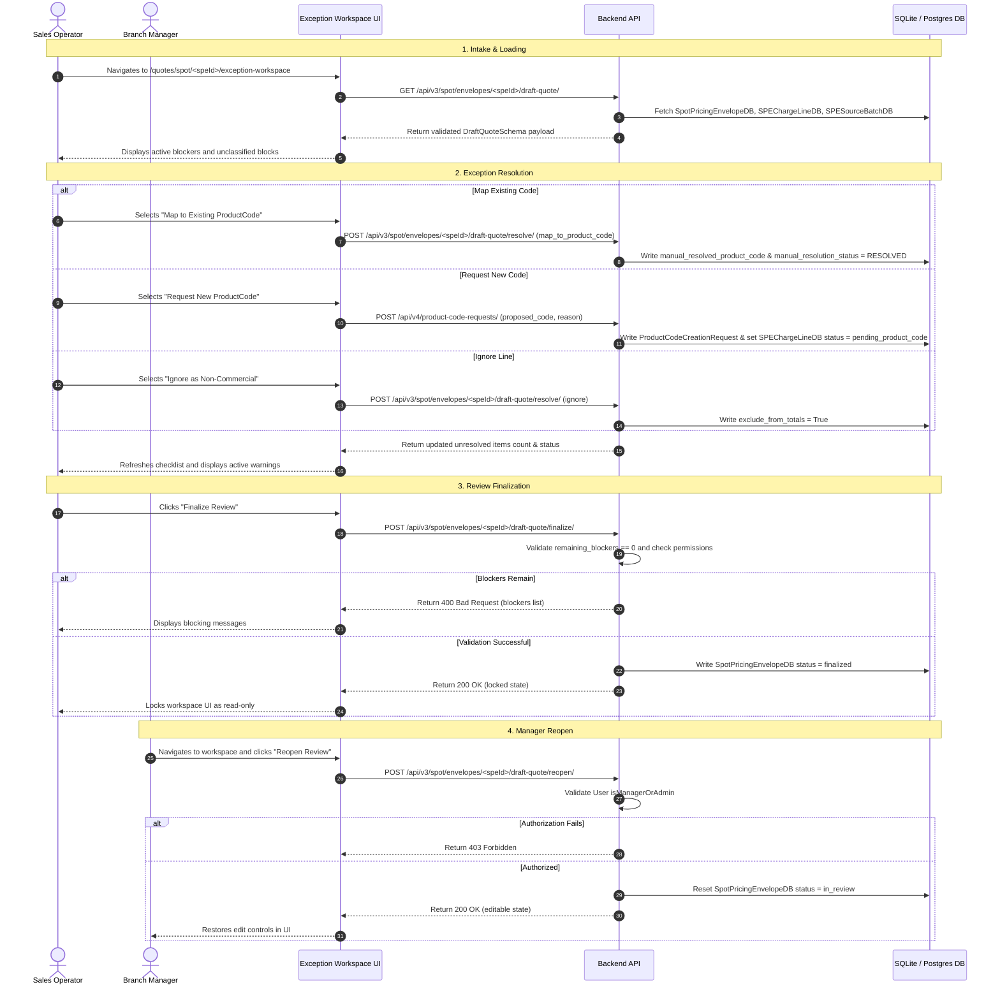

# SPOT Exception Workspace Simplification and Code-Cleanup Audit

## 1. Executive Summary

This audit evaluates the current implementation of the SPOT Exception Workspace, specifically focusing on the frontend component `ExceptionWorkspace.tsx`, its supporting components, and backend contracts. The Exception Workspace serves as a stateful, operator-guided "Draft Quote Assistant" designed to resolve ambiguities (unscoped supplier labels, unmapped charge lines, unclassified text blocks) before a SPOT quote is finalized.

Our primary findings indicate that the Exception Workspace is a high-complexity module:
- The main frontend component `ExceptionWorkspace.tsx` spans **1,222 lines of code** and exhibits a **cognitive complexity of 99** (the highest in the frontend codebase).
- It mixes multiple distinct responsibilities: state management, inline resolution forms, wizards for unclassified blocks, math mismatch displays, and final review checklists.
- Prototype residue (e.g., prototype override checkboxes, hardcoded mock data, and mock banners) is still present in the production layout.
- There is significant functional and layout duplication between the inline forms in `ExceptionWorkspace.tsx` and the side sheet in `SpotChargeLineManualReviewSheet.tsx`.

This document maps out a low-risk strategy for **Phase 14B** to clean up dead code, extract nested components, and simplify the user interface without altering the API contracts, V4 pricing engine, or RBAC controls.

---

## 2. Current Architecture

### 2.1 File Inventory and Line Counts

| Layer | File Path | Line Count | Primary Responsibility |
| --- | --- | --- | --- |
| **Frontend Page** | [page.tsx (Live)](file:///c:/Users/commercial.manager/dev/Project-RateEngine/frontend/src/app/quotes/spot/[speId]/exception-workspace/page.tsx) | 131 | Loads live draft quote data via `speId` and mounts `ExceptionWorkspace`. |
| **Frontend Page** | [page.tsx (Demo)](file:///c:/Users/commercial.manager/dev/Project-RateEngine/frontend/src/app/quotes/spot/exception-workspace-demo/page.tsx) | 16 | Mounts `ExceptionWorkspace` with default mock data for design preview. |
| **Frontend UI** | [ExceptionWorkspace.tsx](file:///c:/Users/commercial.manager/dev/Project-RateEngine/frontend/src/components/spot/ExceptionWorkspace.tsx) | 1222 | Unified workspace component managing state and workflows. |
| **Frontend UI** | [SpotChargeLineManualReviewSheet.tsx](file:///c:/Users/commercial.manager/dev/Project-RateEngine/frontend/src/components/spot/SpotChargeLineManualReviewSheet.tsx) | 532 | Slide-over sheet for manual ProductCode mapping on the main envelope page. |
| **Frontend Types** | [draft-quote-types.ts](file:///c:/Users/commercial.manager/dev/Project-RateEngine/frontend/src/lib/draft-quote-types.ts) | 182 | TypeScript interfaces representing the backend `DraftQuoteSchema` contract. |
| **Frontend Client** | [api.ts](file:///c:/Users/commercial.manager/dev/Project-RateEngine/frontend/src/lib/api.ts#L790-L856) | 67 (scoped) | API client wrappers (`getDraftQuote`, `resolveDraftQuoteDecisions`, `finalizeDraftQuoteReview`). |
| **Backend Views** | [spot_views.py](file:///c:/Users/commercial.manager/dev/Project-RateEngine/backend/quotes/spot_views.py#L3284-L3604) | 320 (scoped) | Django REST Framework API views for draft quote retrieval, resolution, finalization, and reopening. |
| **Backend Contract** | [draft_quote_contract.py](file:///c:/Users/commercial.manager/dev/Project-RateEngine/backend/quotes/contracts/draft_quote_contract.py) | 329 | Pydantic schemas validating client payloads and API responses. |
| **Backend Service** | [draft_quote_adapter.py](file:///c:/Users/commercial.manager/dev/Project-RateEngine/backend/quotes/services/draft_quote_adapter.py) | 455 | Adapter service mapping `SpotPricingEnvelopeDB` and related models to `DraftQuoteSchema`. |
| **Backend Service** | [draft_quote_resolve_service.py](file:///c:/Users/commercial.manager/dev/Project-RateEngine/backend/quotes/services/draft_quote_resolve_service.py) | 358 | Transaction-safe processor applying operator resolutions to database records. |
| **Backend Service** | [draft_quote_review_service.py](file:///c:/Users/commercial.manager/dev/Project-RateEngine/backend/quotes/services/draft_quote_review_service.py) | 78 | State machine manager validating blockers during finalization and handling reopen requests. |

### 2.2 Component State Groups (ExceptionWorkspace.tsx)

`ExceptionWorkspace` relies on a flat state configuration within a single component:
1. **Mock Ingestion Data**: `draftQuote` (persisted mock baseline).
2. **Review Elements State**: `suggestedCharges`, `reviewQueue`, `unclassifiedItems`, `ignoredItems`, and `decisions` (the log of decisions applied in the current session).
3. **Session Status**: `reviewSession` (tracks status, finalizer metadata, remaining blockers, and allowed actions).
4. **Active Workflow Tracking**: `activeIssueId` (ID of the currently highlighted blocker in the queue), `selectedActionType` (tracks sub-form view: `map_existing`, `request_product_code`, `add_charge`), and `showHelpText`.
5. **Accordions Toggles**: `showSuggested`, `showTerms`, and `showTotalsPanel`.
6. **Billing Request Inputs**: `reqLabel`, `reqSource`, `reqCurrency`, `reqAmount`.
7. **Unclassified Block Wizard Inputs**: `unknownStep`, `unknownClassification`, `addName`, `addBucket`, `addCurrency`, `addAmount`, `addUnit`, `addProductCode`.
8. **UI Banner**: `actionMessage` (feedback banner text).
9. **Prototype Toggle**: `prototypeOverride` (allows bypassing blocks when testing).

### 2.3 Event Handlers (ExceptionWorkspace.tsx)

- `handleUndoDecision(id)`: Rolls back a decision from the local state list and restores the previous snapshot.
- `handleFinalizeReview()`: Submits the finalization request to the backend or updates mock state to `finalized`.
- `handleUseApprovedProductCode(...)`: Directly applies an admin-approved ProductCode request.
- `handleMapProductCode(...)`: Submits a `map_to_product_code` decision.
- `handleOpenRequestProductCode(...)`: Pre-fills the ProductCode request fields.
- `handleSubmitProductCodeRequest(...)`: Submits a `request_product_code` decision.
- `handleAcceptSuggestedMapping(...)`: Directly accepts a matching ProductCode mapping suggestion.
- `handleIgnoreCharge(...)`: Marks a charge line to be excluded from totals.
- `handleIgnoreUnknownCharge(...)`: Excludes an unclassified text block.
- `handleMakeActive(...)`: Highlights selected item in unresolved queue.
- `handleAddUnknownAsCharge(...)`: Creates a new manual charge line from an unclassified text block.
- `toggleIncludeInTotals(id)`: Toggles inclusion status for calculations.

### 2.4 Render Sections (ExceptionWorkspace.tsx)

1. **Header Banner**: EFM branding and remaining blockers counter.
2. **Current Task Indicator**: Action-oriented next step guidance (e.g., "Choose a ProductCode for FSC").
3. **API Alert Messages**: Success or error alerts.
4. **Active Resolution Workspace**: Form panel displaying the highlighted exception, source evidence, and context-specific action sub-forms.
5. **Needs Attention List**: Summary queue of unresolved items remaining.
6. **Review Decisions Log**: Undo-capable log of decisions applied in the current session.
7. **Suggested Charges Accordion**: List of all charges with status tags.
8. **Commercial Terms Accordion**: Extracted terms (validity, cargo conditions).
9. **Verification Warnings & Totals Accordion**: Mixed-currency breakdowns and math mismatch metrics.
10. **Ignored Items List**: Ignored segments.
11. **Final Review Checklist**: Visual validation checkmarks.
12. **Finalize Action Footer**: Prototype override check and "Finalize Review" lock action.

---

## 3. Live Operator Workflow

The live workspace workflow maps the operator journey through exception resolution and review finalization:



---

## 4. Baseline Command Results

### 4.1 Static Analysis Results (Fallow)
- **`npx fallow --format json`**: Successfully identified high-impact complexity hotspots. Under frontend components, `ExceptionWorkspace.tsx` scored the highest priority score due to a **cognitive complexity of 99** (threshold: 30) and a Maximum CRAP index of 4556. `SpotChargeLineManualReviewSheet.tsx` registered a **cognitive complexity of 44** with a CRAP index of 1190.
- **`npx fallow dead-code --format json`**: Flags unused type declarations and exports in:
  - `frontend/src/lib/api.ts` (e.g., `V4SellRate`, `V4RateCardUploadErrorResponse`).
  - `frontend/src/lib/permissions.ts` (e.g., `EffectivePermissions`).
  - `frontend/src/lib/schemas/spotSchema.ts` (e.g., `SpotChargeLineValues`).
  - `frontend/src/lib/spot-types.ts` (e.g., `ManualAssertionInput`, `SpotModeActions`).
  - `frontend/src/lib/types.ts` (e.g., `Company`, `StationSummary`).
- **`npx fallow dupes --format json`**: Duplication density is at **10.02%** (5,050 duplicated lines out of 50,361 total lines). The `api.ts` client file contains multiple repeated fetch structures for SPOT endpoints that can be consolidated.
- **`npx fallow health --format json`**: Confirmed the high complexity of the Exception Workspace UI module and recommended extracting sub-components.

### 4.2 Frontend Quality Checks
- **`npm run lint`**: Completed with **0 errors** and 44 warnings (primarily regarding unused imports and typescript parameters in test scripts).
- **`npm run typecheck`**: Completed with **no TypeScript compiler issues**.
- **`npm run build`**: Next.js production build compiled successfully with Turbopack in 32 seconds.
- **Exception Workspace Tests**: All 4 frontend test configurations passed:
  - `test:spot-finalization` (Passed)
  - `test:spot-workspace-helpers` (Passed)
  - `test:exception-workspace-routing` (Passed)
  - `test:draft-quote-contract` (Passed)

### 4.3 Backend Quality Checks
- **Django system check**: `python backend/manage.py check` returned **no issues**.
- **Django test suite**: `python backend/manage.py test quotes.tests` ran **489 tests** and returned **OK** (all tests passed). This includes the integration test `test_spot_exception_workspace_e2e.py`.

---

## 5. Complexity Hotspots

The cognitive complexity of 99 in `ExceptionWorkspace.tsx` is driven by:
- **Excessive Local State**: Managing 15+ interactive React states in a single component causes layout and update bloat.
- **Nested Inline Render Conditions**: Massive ternary statements are used to render the appropriate sub-form depending on the `selectedActionType` and `activeIssue.type`.
- **Inline Wizards**: The "Unknown Charge Block" resolution flows are hardcoded as step-by-step stateful branches directly within the main return statement.
- **Dynamic Calculation Reductions**: Reducers to split totals by currency, validate math balances, and check checklist states are computed inline on every render cycle.

---

## 6. Duplication Findings

We identified clear functional duplication between `ExceptionWorkspace.tsx` and `SpotChargeLineManualReviewSheet.tsx`:
- **ProductCode Requests**: Both components implement a ProductCode request form. `SpotChargeLineManualReviewSheet` includes a detailed form containing `suggested_name`, `suggested_bucket` (bucket options mapping), `suggested_basis` (unit basis mapping), and `suggested_reason`. `ExceptionWorkspace.tsx` contains a simplified inline form (lines 815–850) that requests `proposed_code` and `reason`.
- **Canonical ProductCode Search**: Both components search and map existing ProductCodes. `SpotChargeLineManualReviewSheet` uses a custom autocomplete `Combobox` element. `ExceptionWorkspace` uses a primitive HTML `<select>` list containing only four hardcoded codes (lines 801–804: `AF-FREIGHT`, `AF-FUEL`, `AF-SEC`, `AF-HC`).

---

## 7. Dead, Legacy, and Prototype Candidates

The following symbols and UI structures are legacy leftovers from the early prototypes and are safe to decommission:
- **Mock Data Import**: `hardCaseAirImportData` is imported on line 5 and used as the fallback `initialData` property. It should be removed once live UAT is mandatory.
- **Prototype Override Checkbox**: The checkbox UI `Prototype override only — not available for production.` (lines 101, 1192–1202) and its status banner (line 1213) bypass all checklist blockers. In a live environment under UAT, this override is a security and correctness risk.
- **Inline Helpers**: Helper functions like `humanizeRate` (lines 8–26) contain hardcoded strings and should be extracted to a shared utility file.

---

## 8. Operator-Facing Clutter Findings

Every section in the current live Exception Workspace can be categorized under the following usability framework:

```
[Core Operator Action]
  ├── Resolve Blocker (Accept / Map / Ignore)
  ├── Request ProductCode (Inline Form)
  └── Lock Workspace (Finalize Review)

[Required Risk & Control Info]
  ├── Blocker Messages ("FSC requires billing code validation")
  ├── Mixed-Currency Warnings ("Totals Need Review")
  └── Mathematical Mismatch Status ("Calculated sum difference")

[Supporting Evidence (Progressive Disclosure Candidate)]
  └── Source Quote Text & Document Reference ("FSC rate: USD 0.85 per kg")

[Duplicated / Legacy Information (Cleanup Candidate)]
  ├── Extracted Terms list (unrelated cargo terms clog the layout)
  └── Prototype Banners & Blockers Override UI (clutters the final review block)
```

---

## 9. Protected Behaviours and Regression Coverage

Any cleanup, refactoring, or extraction must preserve the following business rules:

| Protected Behaviour | Backend Safeguard | Frontend Test Coverage |
| --- | --- | --- |
| **Live Draft Quote Loading** | `SpotEnvelopeDraftQuoteAPIView` | [exception-workspace-routing.test.mjs](file:///c:/Users/commercial.manager/dev/Project-RateEngine/frontend/scripts/exception-workspace-routing.test.mjs) |
| **Decision Persistence** | `apply_draft_quote_decisions` (Transactions) | [draft-quote-contract.test.mjs](file:///c:/Users/commercial.manager/dev/Project-RateEngine/frontend/scripts/draft-quote-contract.test.mjs) |
| **ProductCode Request Flow** | `ProductCodeCreationRequestViewSet` (Deduplication) | [test_spot_productcode_close_loop_launch_gate.py](file:///c:/Users/commercial.manager/dev/Project-RateEngine/backend/quotes/tests/test_spot_productcode_close_loop_launch_gate.py) |
| **Finalization Blockers** | `finalize_review` (Restricts lock if blockers > 0) | [spot-finalization.test.mjs](file:///c:/Users/commercial.manager/dev/Project-RateEngine/frontend/scripts/spot-finalization.test.mjs) |
| **Finalized Workspace Lock** | `is_finalized` (Returns 409 Conflict on resolve attempt) | [test_spot_exception_workspace_e2e.py](file:///c:/Users/commercial.manager/dev/Project-RateEngine/backend/quotes/tests/test_spot_exception_workspace_e2e.py) |
| **Manager/Admin Reopen** | `reopen_review` (Restricts reopen to managers/admins) | [test_spot_exception_workspace_e2e.py](file:///c:/Users/commercial.manager/dev/Project-RateEngine/backend/quotes/tests/test_spot_exception_workspace_e2e.py) |
| **Manual-Review Safety** | Unscoped ambiguous labels must remain unresolved | [test_spot_template_validation_review.py](file:///c:/Users/commercial.manager/dev/Project-RateEngine/backend/quotes/tests/test_spot_template_validation_review.py) |

---

## 10. Safe Cleanup Candidates

We recommend performing the following low-risk extractions and removals in **Phase 14B**:
1. **Decommission the Prototype Override Checkbox**: Completely remove the `proto-override` checkbox, state, and footer text. Bypassing blocker checks is not permitted in UAT or production.
2. **Remove Default Mock Data**: Delete the import of `hardCaseAirImportData` and set `initialData` as a required prop.
3. **Extract Sub-Components**:
   - Extract the active resolution sub-forms (`MapExistingForm`, `RequestProductCodeForm`, `AddChargeForm`) to a new subdirectory `frontend/src/components/spot/workspace/`.
   - Extract the warnings and totals displays (`TotalsBreakdownPanel`).
4. **Extract Helper Utilities**: Move `humanizeRate` and `friendlyStatus` to `frontend/src/lib/spot-workspace-helpers.ts` where similar helpers reside.

---

## 11. Risky or Deferred Candidates

The following changes present regression risks and should be deferred:
- **Consolidating forms with SpotChargeLineManualReviewSheet**: While structurally similar, the side sheet uses a different routing/context paradigm (it interacts with the full `SPEChargeLine` schema directly, whereas the Exception Workspace interacts with `DraftCharge` contracts). Merging these during refactoring introduces a high risk of breaking layout state and API resolutions. Keep them separate.
- **Altering API Contracts**: Do not modify `DraftQuoteSchema` or backend serializer definitions. Any change to the validation schemas will break integration checks.

---

## 12. Separation of UI Simplification from Code Cleanup

To maintain regression safety, Phase 14B must separate UI alterations from code reorganization:
- **UI Simplification**: Consists of removing the prototype override controls, standardizing style padding, and hiding raw document evidence behind an expandable progressive disclosure toggle. These changes alter visual representation and must be verified by visual checks.
- **Code Cleanup**: Consists of extracting complex conditional render blocks into nested stateless React components. These changes must not alter the DOM footprint or state update cycles and must keep all regression tests passing.

---

## 13. Recommended Implementation Sequence

```
Step 1: Dead-Code & Prototype Removal
  ├── Remove prototype override checkbox and footer
  └── Remove hardCaseAirImportData fallback
Step 2: Component Extraction
  ├── Extract MapExistingForm, RequestProductCodeForm, AddChargeForm
  └── Extract TotalsBreakdownPanel
Step 3: Helper Relocation
  └── Move humanizeRate and friendlyStatus to helpers.ts
Step 4: Verification
  └── Run npm run build & full test suites
```

---

## 14. Phase 14B Scope

The exact scope for Phase 14B is restricted to the following checklist:

### A. Dead Code and Banners Cleanup
- [ ] Remove `prototypeOverride` state and related handlers in `ExceptionWorkspace.tsx`.
- [ ] Delete `hardCaseAirImportData` import and default parameter assignment.
- [ ] Remove the checkbox element `<input type="checkbox" id="proto-override"...>` and the label block.
- [ ] Remove the helper text "Prototype only — Changes made will not be permanently saved." from the footer.

### B. Helper Extraction
- [ ] Move `humanizeRate` and `friendlyStatus` to `frontend/src/lib/spot-workspace-helpers.ts`.
- [ ] Export these helpers and reference them in `ExceptionWorkspace.tsx`.

### C. UI Component Extraction
- [ ] Create `frontend/src/components/spot/workspace/MapExistingForm.tsx` (stateless UI for selecting and mapping a ProductCode).
- [ ] Create `frontend/src/components/spot/workspace/RequestProductCodeForm.tsx` (UI for creating a ProductCode request).
- [ ] Create `frontend/src/components/spot/workspace/AddChargeForm.tsx` (UI for manual charge additions).
- [ ] Create `frontend/src/components/spot/workspace/TotalsBreakdownPanel.tsx` (UI displaying mathematical summaries and currency alerts).
- [ ] Reference these sub-components in `ExceptionWorkspace.tsx` to reduce cognitive complexity below 40.

### D. Regression Testing
- [ ] Verify that `npm run lint` and `npm run typecheck` run clean.
- [ ] Ensure that `npm run test:spot-finalization` and related scripts pass successfully.
- [ ] Ensure Django backend test suites pass with no failures.
