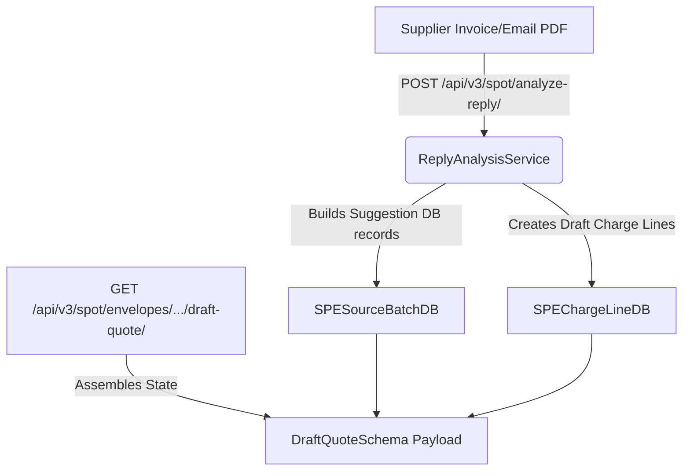
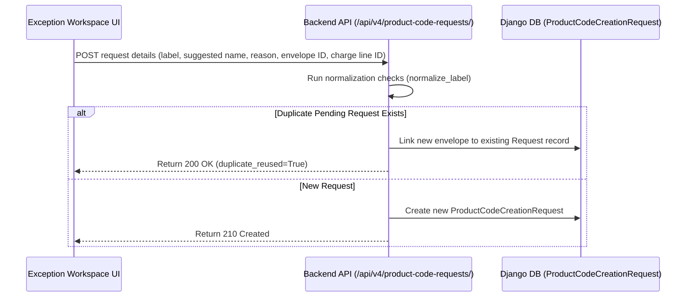

# Phase 8D.5 — Exception Workspace Backend Integration Plan

This document outlines how the frontend Exception Workspace prototype connects to real SPOT intake and backend data models. 

---

## 1. Proposed API Endpoints

### 1.1 Fetch Draft Quote Payload
* **Endpoint**: `GET /api/v3/spot/envelopes/<uuid:envelope_id>/draft-quote/`
* **Permission**: `IsAuthenticated`, `IsSalesManagerOrAdmin`
* **Purpose**: Retrieves the unified workspace state (structured as `DraftQuoteSchema`) derived from `SpotPricingEnvelopeDB`, its child `SPEChargeLineDB` records, and raw `SPESourceBatchDB` ingestion artifacts.

### 1.2 Submit Workspace Corrections / Resolve Charges
* **Endpoint**: `POST /api/v3/spot/envelopes/<uuid:envelope_id>/draft-quote/resolve/`
* **Permission**: `IsAuthenticated`, `IsSalesManagerOrAdmin`
* **Purpose**: Persists human decisions (mapping ProductCodes, updating values, ignoring lines, confirming currencies) back to the database in a single atomic transaction.

### 1.3 Create ProductCode Requests
* **Endpoint**: `POST /api/v4/product-code-requests/`
* **Permission**: `IsAuthenticated`, `IsSalesManagerOrAdmin`
* **Purpose**: Submits a request to catalog admin users to create a new billing product code. (Leverages the existing `ProductCodeCreationRequestViewSet` but outlines strict UI integration rules).

---

## 2. Backend Data Flow: Ingestion → Draft Quote Payload



1. **Extraction / Intake**:
   - The user uploads a PDF or submits email text to `/api/v3/spot/analyze-reply/` with `use_ai=True`.
   - `ReplyAnalysisService` parses rate structures, producing raw assertions and unclassified fragments.
   - `ReplyAnalysisService.build_spe_charges_from_analysis` populates draft `SPEChargeLineDB` lines linked to the parent `SpotPricingEnvelopeDB` and `SPESourceBatchDB`.

2. **State Construction (`GET` Draft Quote)**:
   - When the user opens the Exception Workspace, the frontend calls `GET /api/v3/spot/envelopes/<id>/draft-quote/`.
   - The backend reads:
     - `SpotPricingEnvelopeDB` (shipment_context_json, metadata, organization details).
     - Associated `SPEChargeLineDB` lines.
     - Associated `SPESourceBatchDB` (for raw email text, filename, file content type, or extraction metadata).
   - The backend maps the database state to the `DraftQuoteSchema` contract:
     - **Clean Mapped Lines** (`normalization_status == MATCHED` and `manual_resolution_status != RESOLVED`): Mapped to `status: "suggested"`.
     - **Exceptions / Ambiguities** (`normalization_status != MATCHED` OR `product_code_conflict == True`): Mapped to `status: "needs_review"` and appended to the `review_queue`.
     - **Unclassified Sections** (`SPESourceBatchDB.analysis_summary_json.unclassified_items`): Mapped to `unclassified_items`.
     - **Ignored Sections**: Mapped to `ignored_items`.

---

## 3. SPEChargeLineDB Synchronization Rules

When the user submits corrections via `POST /api/v3/spot/envelopes/<id>/draft-quote/resolve/`, the payload is synced to `SPEChargeLineDB` under the following rules:

| Workspace State Action | `SPEChargeLineDB` Fields Affected | Sync Rule |
| :--- | :--- | :--- |
| **Accepted suggestion** | `manual_resolution_status`, `manual_resolution_by`, `manual_resolution_at` | Marks `manual_resolution_status = RESOLVED` and populates auditing metadata. |
| **Mapped to ProductCode** | `manual_resolved_product_code`, `manual_resolution_status`, etc. | Associates the selected `ProductCode` ID and transitions status to `RESOLVED`. |
| **Ignored / Excluded** | `exclude_from_totals` | Sets `exclude_from_totals = True` to prevent this charge from rolling up into V4 calculations. |
| **Pending ProductCode** | `manual_resolution_status` (Custom flag) | Holds status in a pending state until admin approvals run. |

---

## 4. ProductCode Creation Request Integration



1. **Workspace Request Creation**:
   - The user triggers a code request dialog.
   - The client posts to `/api/v4/product-code-requests/`.
2. **Deduplication**:
   - The view uses `ProductCodeCreationRequest.normalize_label` to clean the source label.
   - If an existing pending request exists for the same normalized label/name, it links the current `source_envelope` and `source_charge_line` to it and returns `duplicate_reused=True`.
3. **Status Integration**:
   - The `SPEChargeLineDB` record has its temporary review status set to `pending_product_code`.

---

## 5. Request and Response Schemas

### 5.1 GET /api/v3/spot/envelopes/<uuid:id>/draft-quote/ (Response)
Returns the validated `DraftQuoteSchema` (as defined in `draft_quote_contract.py`), with the following recommended metadata extension:

```json
{
  "contract_version": "1.0.0",
  "quote_summary": "Singapore (SIN) to Port Moresby (POM) standard air freight quote from Qantas Air Cargo",
  "shipment_context": {
    "origin": "SIN",
    "destination": "POM",
    "mode": "AIR",
    "pieces": 3,
    "chargeable_weight_kg": 200.0
  },
  "supplier_context": {
    "supplier_name": "Qantas Air Cargo",
    "agent_code": "QAN-SIN"
  },
  "suggested_charges": [
    {
      "id": "chg-002",
      "status": "needs_review",
      "display_label": "Fuel Surcharge",
      "raw_label": "FSC USD 0.85/kg",
      "suggested_product_code": null,
      "product_code_conflict": true,
      "bucket": "airfreight",
      "currency": "USD",
      "amount": 170.00,
      "rate": 0.85,
      "unit": "per_kg",
      "include_in_totals": true,
      "warnings": ["Ambiguous product code match: maps to FSC-AIR or SUR-FUEL"],
      "review_reason": "Ambiguous ProductCode mapping due to multiple matching rules",
      "evidence": {
        "source_text": "FSC rate: USD 0.85 per kg",
        "page": 1,
        "section": "Freight surcharges"
      },
      "correction_actions": ["MAP_PRODUCT_CODE", "REQUEST_PRODUCT_CODE", "IGNORE_CHARGE"]
    }
  ],
  "unclassified_items": [
    {
      "id": "unclass-001",
      "raw_text": "Possible cartage / transfer charge: SGD 120.00",
      "review_reason": "Unclassified text block"
    }
  ],
  "ignored_items": [],
  "totals_validation": {
    "math_balances": false,
    "currency_consistent": false,
    "calculated_total": 1145.00,
    "extracted_total": 1100.00,
    "difference": 45.00,
    "tolerance": 0.00,
    "warnings": ["Totals mismatch"]
  },
  "review_queue": [
    {
      "id": "chg-002",
      "type": "charge_needs_review",
      "message": "Fuel Surcharge requires billing code validation"
    },
    {
      "id": "unclass-001",
      "type": "unknown_charge",
      "message": "Unclassified commercial-looking block"
    }
  ],
  "correction_actions": [],
  "metadata": {
    "document_metadata": {
      "file_name": "QAN-QUOTE-9912.pdf",
      "file_size": 245102,
      "processing_time_ms": 1280
    },
    "user_audit_log": []
  }
}
```

### 5.2 POST /api/v3/spot/envelopes/<uuid:id>/draft-quote/resolve/ (Request)
Sends corrected charge lines back to the backend.

```json
{
  "resolutions": [
    {
      "charge_id": "chg-002",
      "action": "MAP_PRODUCT_CODE",
      "product_code": "FSC-AIR",
      "currency": "USD",
      "amount": 170.00,
      "include_in_totals": true
    },
    {
      "charge_id": "unclass-001",
      "action": "IGNORE_ITEM",
      "ignored_reason": "Operator determined it is a duplicate disclaimer line"
    }
  ]
}
```

---

## 6. Audit and History Requirements

To preserve accountability and feed the learning model for AI parsing:
* **Audit Fields**: Map user selections to `manual_resolution_by` (ForeignKey to User) and `manual_resolution_at` (DateTimeField) on `SPEChargeLineDB`.
* **Learning Event**: Trigger `record_manual_resolution_event()` (from `spot_learning_models.py` or equivalent service) upon each successful manual resolution.
* **Workspace Audit Log**: Store details in a JSON audit trail inside `metadata.user_audit_log` within the workspace payload to preserve undo capacity and support multi-editor collaboration.

---

## 7. Permission and RBAC Considerations

* **Role Permissions**: Limit workspace modification to `sales`, `manager`, and `admin` roles (mirroring `IsSalesManagerOrAdmin`).
* **Organization Hierarchy Guardrail**:
  - Enforce access controls such that users can only fetch or resolve envelopes within their designated `Branch` and `Department` (e.g. users associated with `Port Moresby` -> `Air Freight` can only resolve air import quotes within that branch scope).
  - Explicitly restrict cross-operating-entity modifications unless the user holds a global admin role.

---

## 8. Risks and Smallest Safe PR Sequence

### Risks
1. **Concurrency Conflicts**: If multiple operators open the workspace simultaneously, one could overwrite another's resolves.
   - *Mitigation*: Implement optimistic locking via `updated_at` or a tracking hash in the `GET` payload.
2. **V4 Rating Engine Inconsistencies**: Overridden values (e.g. manually set rates/units) might conflict with rating engine rules.
   - *Mitigation*: Ensure any charge marked `accepted_by_user` undergoes complete V4 verification during final quote generation.

### Smallest Safe PR Sequence

1. **PR 1: Read-only Integration & Serializer Setup**
   - Implement the `GET /api/v3/spot/envelopes/<id>/draft-quote/` endpoint.
   - Build a serializer converting `SpotPricingEnvelopeDB` and its child tables into `DraftQuoteSchema`.
   - Add unit tests validating correct extraction mapping (suggested vs. needs_review vs. unclassified).
2. **PR 2: Resolve & Sync Endpoint**
   - Implement `POST /api/v3/spot/envelopes/<id>/draft-quote/resolve/` parsing manual actions.
   - Write transactional updates to `SPEChargeLineDB` (`manual_resolved_product_code`, `exclude_from_totals`, `manual_resolution_status`).
3. **PR 3: ProductCode Creation Request Linkage**
   - Connect the Exception Workspace UI triggers to the `/api/v4/product-code-requests/` endpoint.
   - Ensure the pending request correctly updates the UI state.
4. **PR 4: Dynamic Frontend Connection**
   - Replace the mock states in the frontend `ExceptionWorkspace` component with actual API fetch/post hook integrations.

---

## TODO Checklist
- [ ] Review RateEngine/EFM brand style guide and align Exception Workspace styling with the rest of the app later.
